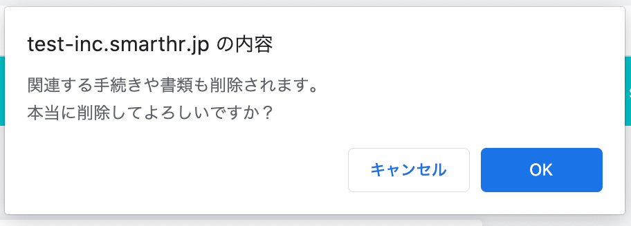
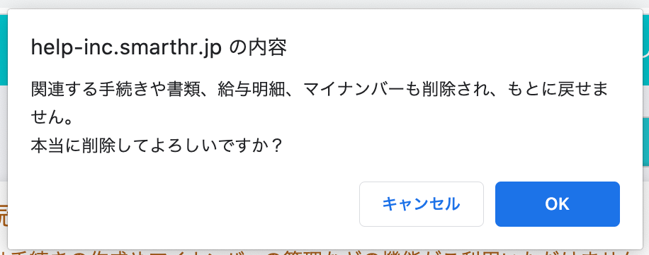

2020年12月7日（月）に行なったアップデートの詳細をお知らせします。

SmartHR基本機能の変更点は、カイゼン1件・不具合修正1件でした。

# 📈 カイゼン

## 従業員情報削除時のメッセージを具体的にしました

従業員情報を削除する際に表示されるダイアログのメッセージを **\[関連する手続きや書類も削除されます。\]** から **\[関連する手続きや書類、給与明細、マイナンバーも削除され、もとに戻せません。\]** に変更しました。

給与明細やマイナンバーも削除されることと、もとに戻せないことを情報として追加しています。

| 変更前 |  |
| --- | --- |
| 変更後 |  |

# 👨‍⚕️ 不具合修正

給与明細のPDF表示に関する1件の不具合修正を行ないました。
