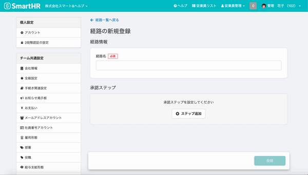
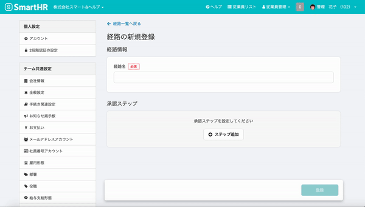
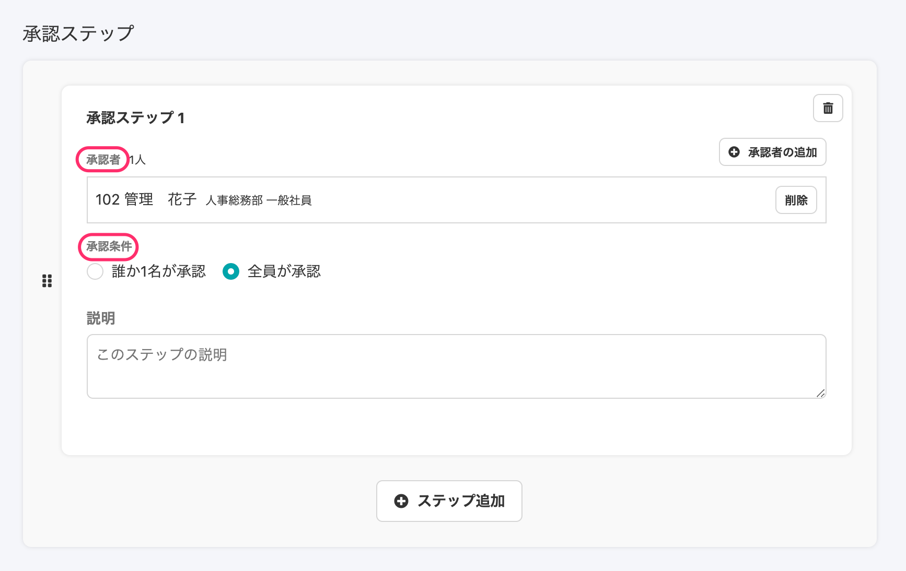
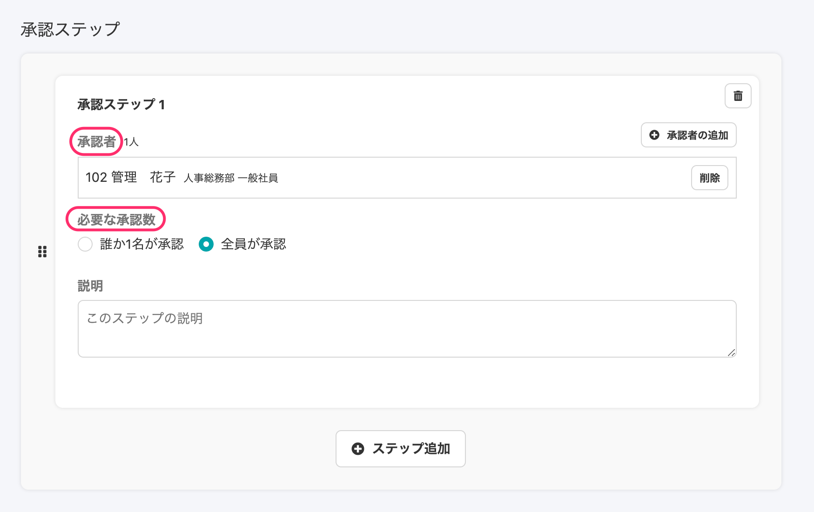
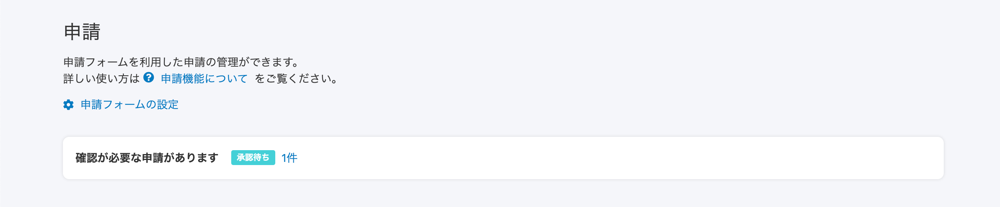
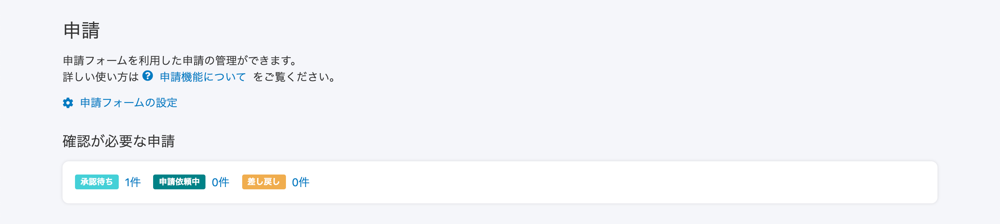

2020年12月8日（火）に行なったアップデートの詳細をお知らせします。

SmartHR基本機能の変更点は、カイゼン5件・不具合修正2件でした。

# 📈 カイゼン

## マルチログインアカウントでログインした際、最後にログインした企業アカウントにログインするようにしました

これまでマルチログインアカウントでSmartHRにログインする際、そのアカウントが最初に招待された企業アカウントにログインする仕様になっていましたが、今回の改修で、そのアカウントが最後にログインしていた企業アカウントにログインするようにしました。

:::related
[マルチログインアカウントでSmartHRにログインする際、最後にログインしていたテナントにログインするようになりました。](https://smarthr.jp/?p=22085&preview=1&_ppp=e8e735c57a)
:::

## 経路の新規登録画面でステップを追加する際の動作を変更しました

これまでは申請の **\[経路の新規登録\]** 画面で **\[+ステップ追加\]** をクリックすると、 **\[承認者の追加\]** ダイアログが表示されていました。

こちらを今後追加される機能の仕様に合わせて **\[+ステップ追加\]** をクリックすると、承認者が未選択の **\[承認ステップ\]** 枠を表示するようにしました。

**\[申請\]** > **\[新規登録\]** > **\[経路を新規登録\]** から作成できます。

| 変更前 |  |
| --- | --- |
| 変更後 |  |

## 経路の承認ステップのデザインを変更しました

経路の詳細画面、新規登録画面で表示される **\[承認ステップ\]** フォームの文言とレイアウトを下記のとおり変更しました。

- **\[承認者\]** の文字の大きさを変更
- **\[承認条件\]** → **\[必要な承認数\]** に変更

| 変更前 |  |
| --- | --- |
| 変更後 |  |

## 申請一覧のTodoパネルに0件の場合も表示するようにしました

これまでは申請一覧のTodoパネルは、「Todoが0件」または「アカウントが従業員に紐づいていない」時は非表示にしていましたが、今回の改修でTodoがない場合も **\[0件\]** として表示するようにしました。

また、タイトルを **\[確認が必要な申請があります\]** から **\[確認が必要な申請\]** に変更し、パネルの外に配置することで視認性を高めました。

| 変更前 |  |
| --- | --- |
| 変更後 |      |

## 新しい給与明細一覧画面の表示を高速化させました

新しい給与明細一覧画面で、明細数が多い場合のパフォーマンスを最適化し表示速度を速めました。

# 👨‍⚕️ 不具合修正

部署の一括更新に関する修正など、2件の不具合修正を行ないました。
