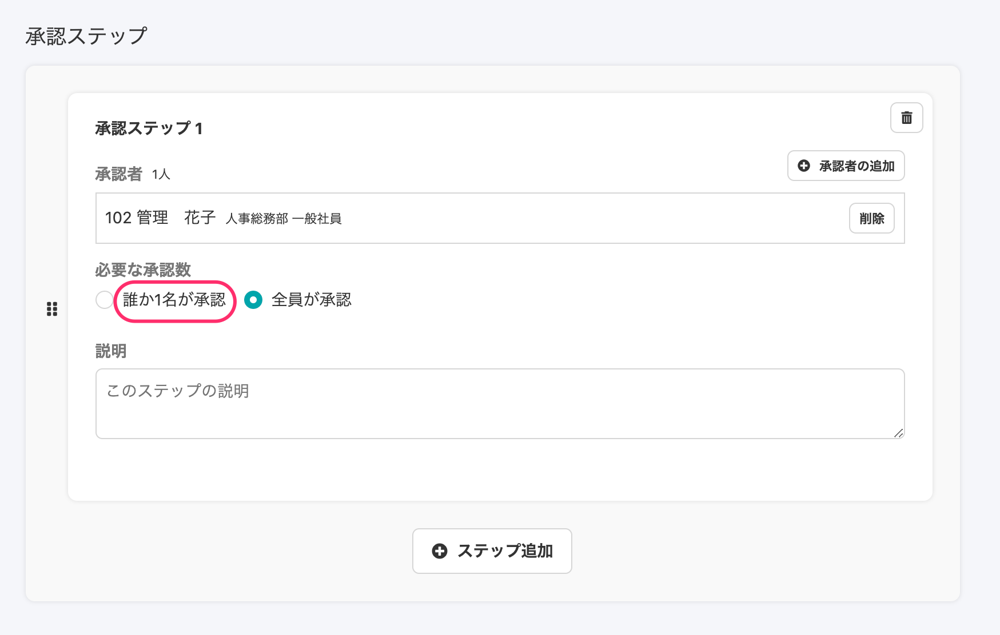
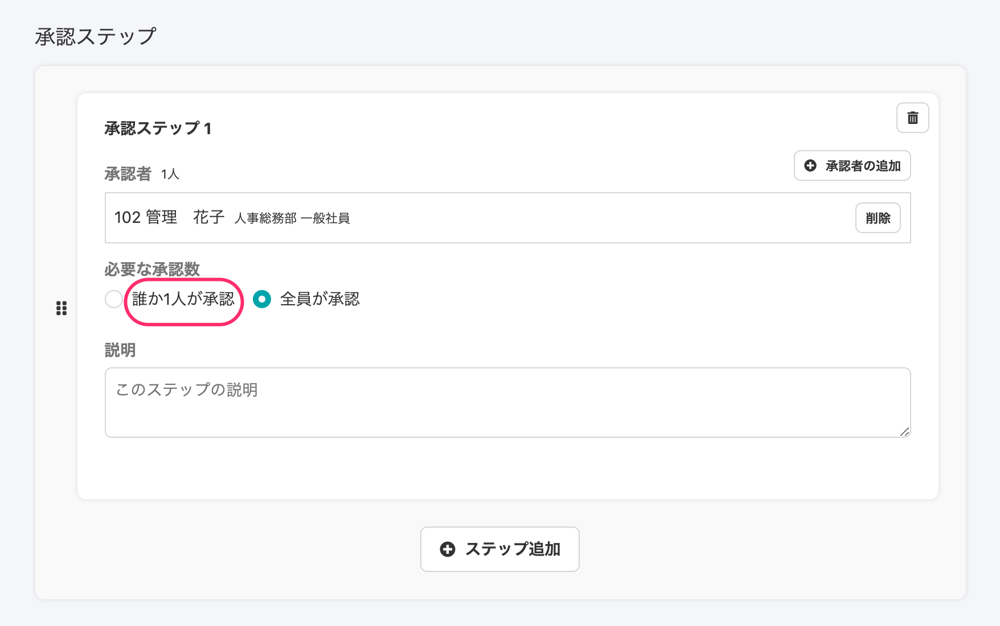
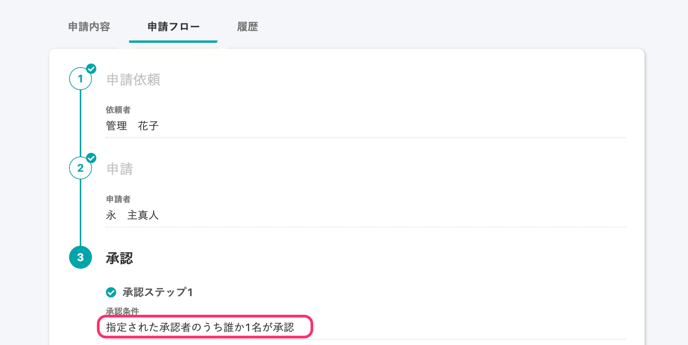
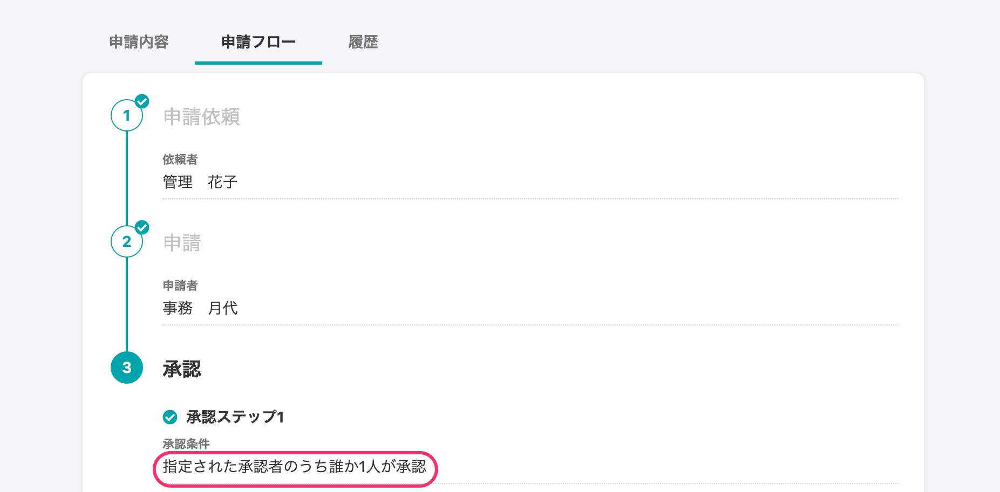

2020年12月9日（水）に行なったアップデートの詳細をお知らせします。

SmartHR基本機能の変更点は、カイゼン1件・不具合修正1件でした。

# 📈 カイゼン

## 経路の承認ステップの文言を \[誰か1人が承認\] に変更しました

経路の **\[承認ステップ\]** の文言を **\[誰か1名が承認\]** から **\[誰か1人が承認\]** に変更しました。

変更箇所は下記のとおりです。

-  **\[申請\]** \> **\[新規登録\]** > **\[経路を新規登録\]** / 詳細画面> **\[承認ステップ\]** 

**\[誰か1名が承認\]** → **\[誰か1人が承認\]** に変更

| 変更前 |  |
| --- | --- |
| 変更後 |  |

- 申請詳細画面の **\[申請フロー\]**タブ > **\[承認ステップ\]** 

**\[指定された承認者のうち誰か1名が承認\]** → **\[指定された承認者のうち誰か1人が承認\]** に変更

| 変更前 |  |
| --- | --- |
| 変更後 |  |

# 👨‍⚕️ 不具合修正

オプション機能の動作異常に関する1件の不具合修正を行ないました。
