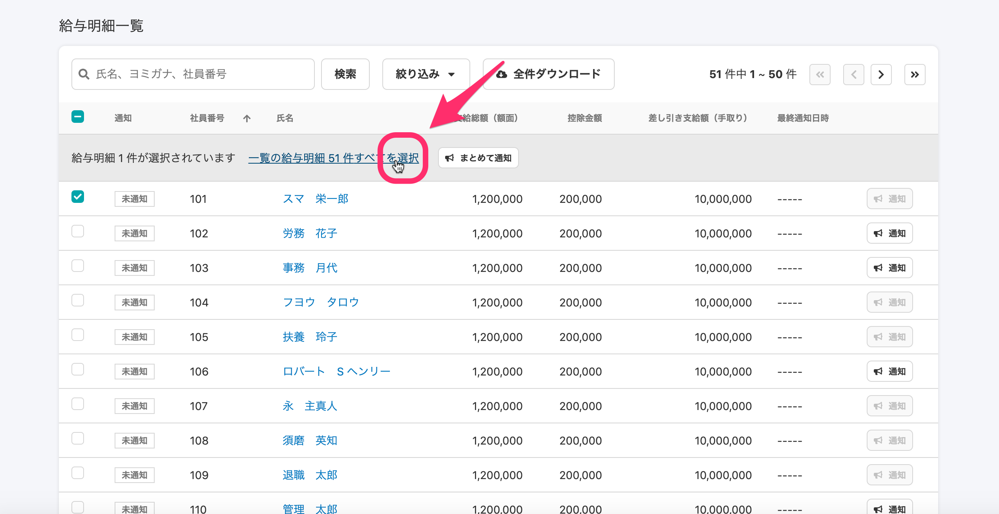
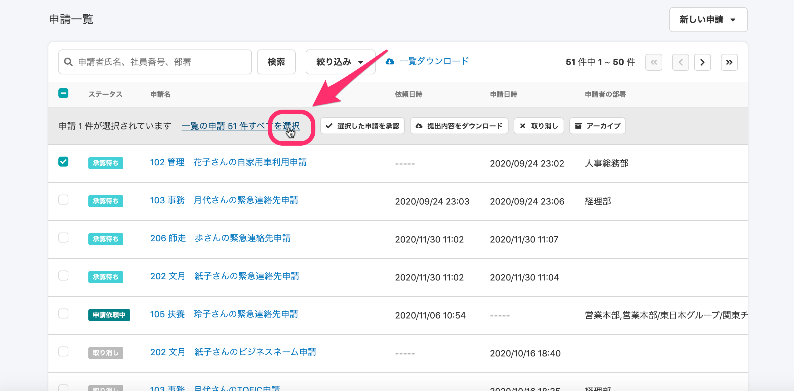

2020年12月11日（金）に行なったアップデートの詳細をお知らせします。

SmartHR基本機能の変更点は、カイゼン1件でした。

# 📈 カイゼン

## ページをまたいだすべての項目にチェックができるリンクにカーソルを重ねた際、ポインタが表示されるようにしました

ページをまたいだすべての項目に対して選択・解除ができるリンクにカーソルを合わせると、ポインタ（指差しアイコン）表示になるようにしました。

対象ページは、新しい給与明細一覧と申請一覧です。

**新しい給与明細一覧画面**

:::related
[【新デザイン向け】給与明細を確定・公開する](https://knowledge.smarthr.jp/hc/ja/articles/360057942354)
:::

**申請一覧画面**

:::related
[従業員から提出された申請を承認する](https://knowledge.smarthr.jp/hc/ja/articles/360053919054)
[申請依頼を一括で取り消す](https://knowledge.smarthr.jp/hc/ja/articles/360026262393)
:::
