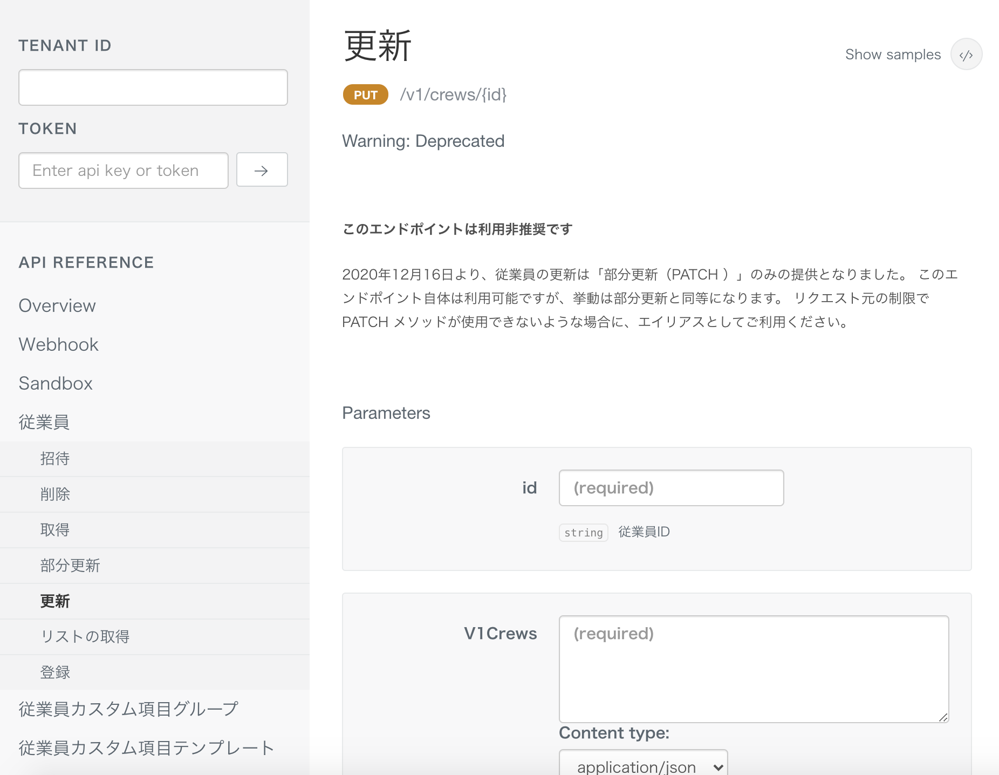

2020年12月16日（水）に行なったアップデートの詳細をお知らせします。

SmartHR基本機能の変更点は、新機能1件・カイゼン1件でした。

# ✨ 新機能

## 「雇用保険被保険者資格取得・喪失届」の様式変更に対応しました

「雇用保険被保険者資格取得・喪失届」は令和2年11月以降の手続きから様式が変更になるので、それにともない、手続き書類・電子申請の様式変更に対応しました。

新しい様式では、在留資格情報の内容が特定の条件を満たす必要があります。

詳しくは、下記のページをご覧ください。

:::related
[雇用保険資格取得届・資格喪失届の電子申請（令和2年11月以降手続き）について](https://knowledge.smarthr.jp/hc/ja/articles/1500000180301)
:::

# 📈 カイゼン

## Smart HR API の従業員更新を「部分更新（PATCH）」のみの提供にしました

Smart HR APIの従業員の「更新（PUT）」を廃止し、「部分更新（PATCH）」のみの提供にしました。

PATCHリクエストに対応していないHTTPクライアントや連携サービスがあるので、PATCHのエイリアスとしてPUTの存在は残しておく予定です。

:::related
[SmartHR API にて従業員更新（PUT操作）を廃止しました](https://smarthr.jp/other/22038)
:::

