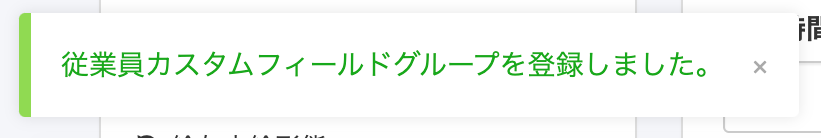

2020年12月21日（月）に行なったアップデートの詳細をお知らせします。

SmartHR基本機能の変更点は、カイゼン2件・不具合修正2件でした。

# 📈 カイゼン

## 従業員カスタム項目を編集した際のフラッシュメッセージを変更しました

従業員カスタム項目を登録・更新・削除した際のフラッシュメッセージを下記のとおり変更しました。

- **\[従業員カスタムフィールドグループを登録しました。\] → \[カスタム項目グループを登録しました。\]**
- **\[従業員カスタムフィールドグループを更新しました。\] → \[カスタム項目グループを更新しました。\]**
- **\[従業員カスタムフィールドグループを削除しました。\] → \[カスタム項目グループを削除しました。\]**

| 変更前 |  |      |  |
| --- | --- | --- | --- |
| 変更後 |  |  |  |

:::related
[従業員項目をカスタマイズする](https://knowledge.smarthr.jp/hc/ja/articles/360026265513)
:::

## 賞与支払届の手続き詳細と電子申請作成画面のパフォーマンスをカイゼンしました

賞与支払届の手続き詳細画面と電子申請作成画面の、従業員数が多い場合のパフォーマンスを最適化し表示速度を速めました。

:::related
[賞与支払届を作成する](https://knowledge.smarthr.jp/hc/ja/articles/360036904573)
:::

# 👨‍⚕️ 不具合修正

氏名変更手続きに関する修正など、2件の不具合修正を行ないました。
