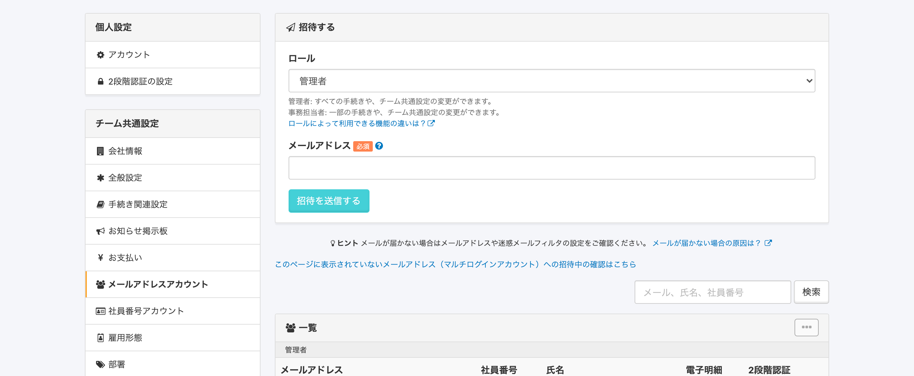
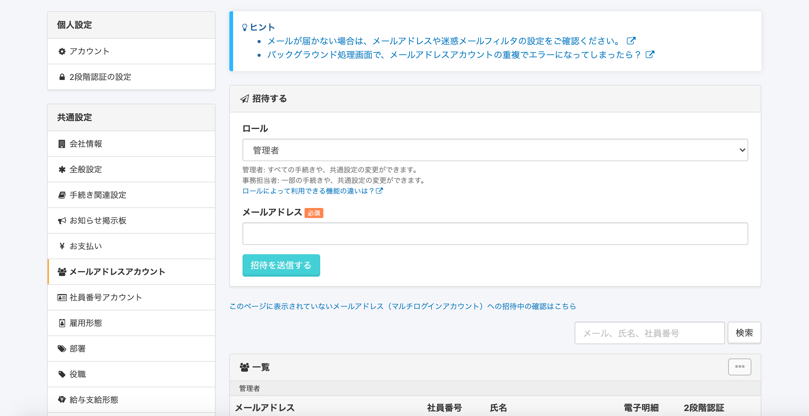
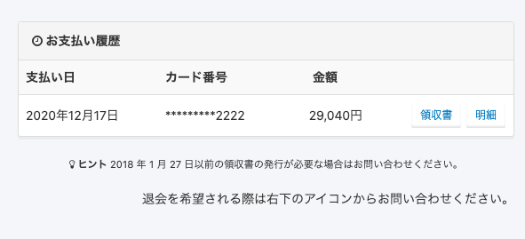
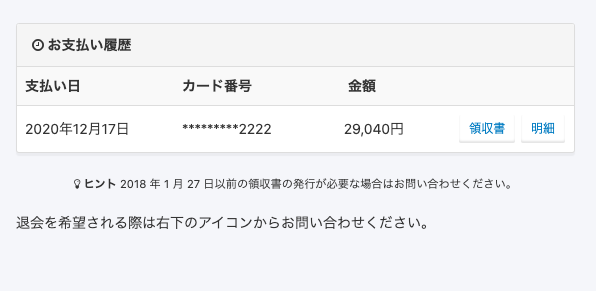
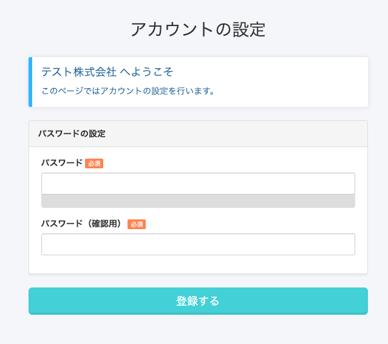
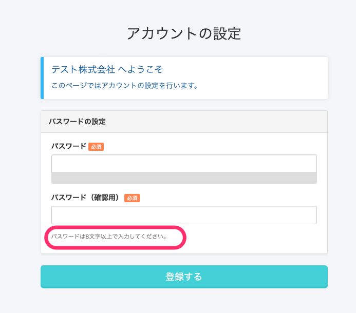
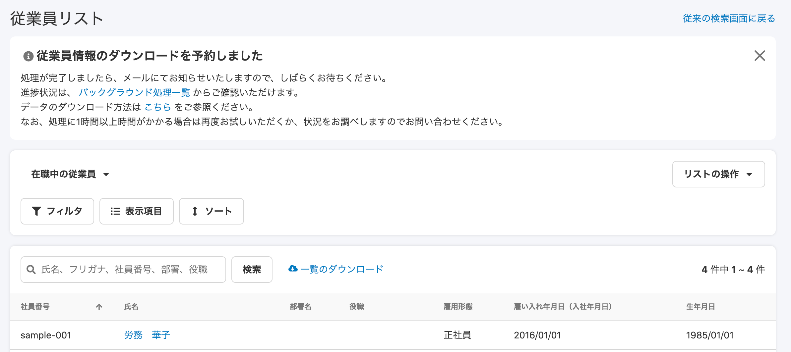
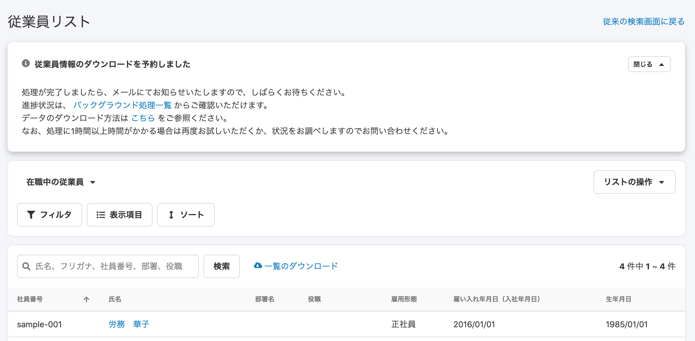
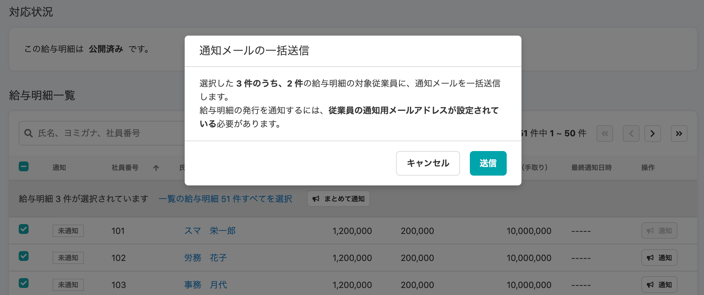
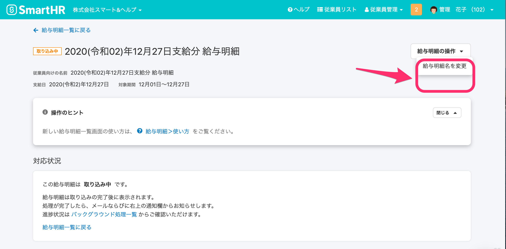

2021年1月4日（月）に行なったアップデートの詳細をお知らせします。

SmartHR基本機能の変更点は、カイゼン6件・不具合修正2件でした。

# 📈 カイゼン

## メールアドレスアカウント画面のヘルプページへの導線をわかりやすくしました

アカウント名 > **\[共通設定\]** > **\[メールアドレスアカウント\]** 画面を、ヘルプページへの導線をわかりやすくするため下記のとおり変更しました。

- メールアドレス入力欄のラベルの \[？\] アイコンを削除
- ヒント欄を削除
- ページの先頭にInformationPanelを作り、上記2箇所に点在していたヘルプページへのリンクをまとめて配置

| 変更前 |  |
| --- | --- |
| 変更後 |      |

## \[お支払い\]ページ最下部のテキストを左揃えにしました

**\[共通設定\]** > **\[お支払い\]** のページ最後にある、**\[退会を希望される際は右下のアイコンからお問い合わせください。\]** を左揃えに配置変更しました。

| 変更前 |  |
| --- | --- |
| 変更後 |  |

## アカウントの設定画面にパスワードの条件文を追加しました

従業員の初回登録フォームのパスワード設定画面に、パスワード設定の条件 **\[パスワードは8文字以上で入力してください。\]** の一文を追加しました。

| 変更前 |  |
| --- | --- |
| 変更後 |  |

## 従業員一覧のダウンロード予約時のパネルを SmartHR UI に変更しました

従業員リストの一覧をダウンロード予約した際に、画面上部に表示されるパネルをSmart HR UIのInformationPanelに変更しました。

| 変更前 |  |
| --- | --- |
| 変更後 |  |

:::related
[従業員リストの使い方](https://knowledge.smarthr.jp/hc/ja/articles/360043824473)
:::

## 給与明細一覧の\[通知メールの一括送信\] に、通知可能件数が表示されるようにしました

新デザイン給与明細一覧で複数従業員をチェックした際に、 **\[まとめて通知\]** をクリックすると表示される **\[通知メールの一括送信\]** のダイアログ内に、通知可能件数を表示するようにしました。

この通知可能件数を確認することで、ページをまたいでチェックしている従業員にも通知されるかわかるようになります。

## 給与明細の取り込み中に明細を削除できないようにしました

給与明細のCSVの取り込み中は **\[給与明細を削除\]** のメニューを表示しないようにし、処理を並行で行なうことでデータが壊れるのを防ぐため、給与明細を削除できないようにしました。

:::related
[給与・賞与明細情報を取り込む](https://knowledge.smarthr.jp/hc/ja/articles/360059997153)
:::

# 👨‍⚕️ 不具合修正

従業員情報更新時のWebhookの挙動に関する修正など、2件の不具合修正を行ないました。
