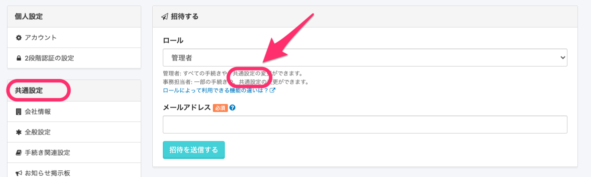

2021年1月5日（火）に行なったアップデートの詳細をお知らせします。

SmartHR基本機能の変更点は、カイゼン1件・不具合修正1件でした。

# 📈 カイゼン

## 共通設定ページのサイドメニューのタイトルを変更しました

アカウント名 > **\[共通設定\]** のサイドメニューのタイトルを、**\[チーム共通設定\]** から **\[共通設定\]** に変更しました。

また、**\[共通設定\] > \[メールアドレスアカウント\] > \[招待する\]** のロールの説明箇所にも **\[チーム共通設定\]**の記載があったため、下記のとおり変更しました。

- **変更前**

管理者: すべての手続きや、チーム共通設定の変更ができます。

事務担当者: 一部の手続きや、チーム共通設定の変更ができます。

- **変更後**

管理者: すべての手続きや、共通設定の変更ができます。

事務担当者: 一部の手続きや、共通設定の変更ができます。

| 変更前 |  |
| --- | --- |
| 変更後 |  |

# 👨‍⚕️ 不具合修正

カスタム項目の履歴編集に関する1件の不具合修正を行ないました。
