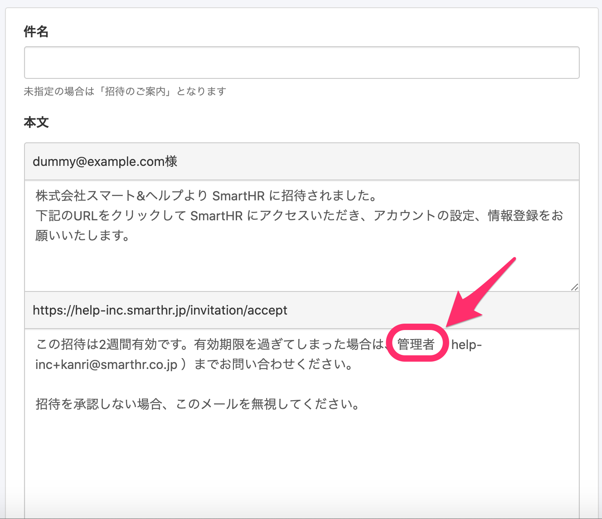

2021年1月8日（金）に行なったアップデートの詳細をお知らせします。

SmartHR基本機能の変更点は、カイゼン2件・不具合修正1件でした。

# 📈 カイゼン

## メールフォーマットの文言を変更しました

SmartHRの全体での表記ルールに合わせるため、新しくメールフォーマットを作成する際のデフォルト文言の一部を **\[チームの管理者\]** から **\[管理者\]** に変更しました

既に存在しているメールフォーマットの内容は変更せず、そのままになっています。

| 変更前 | 変更後 |
| --- | --- |
|  |  |

:::related
[従業員が受け取るメールの内容をカスタマイズする](https://knowledge.smarthr.jp/hc/ja/articles/360026106674)
:::

## 従業員招待と同時に書類の依頼を行なった際の文言を変更しました

必ずしも確認と合意の両方が含まれるとも限らないため、従業員招待と同時に文書配付機能で書類の合意・確認依頼を行なった際の画面の文言を、下記のとおり変更しました。

| 変更前 | 変更後 |
| --- | --- |
|  |  |

:::related
[入社の手続きと同時に雇用契約書を依頼する](https://knowledge.smarthr.jp/hc/ja/articles/360026262173)
:::

# 👨‍⚕️ 不具合修正

内部処理に関する1件の不具合修正を行ないました。
