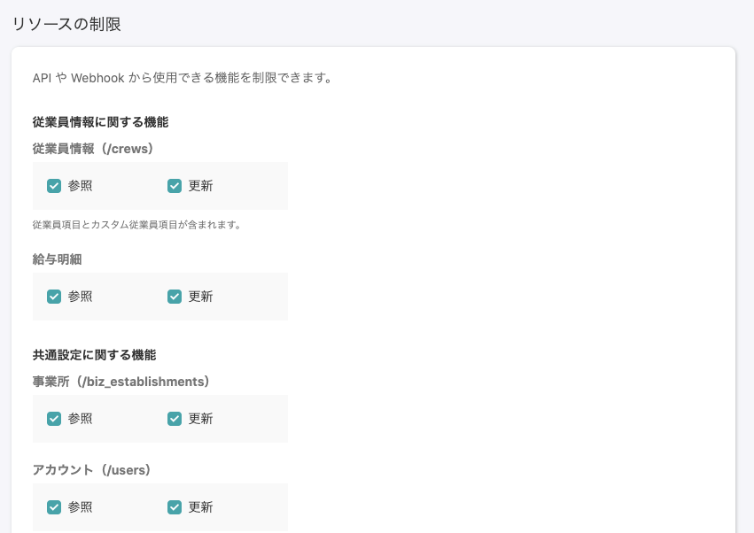
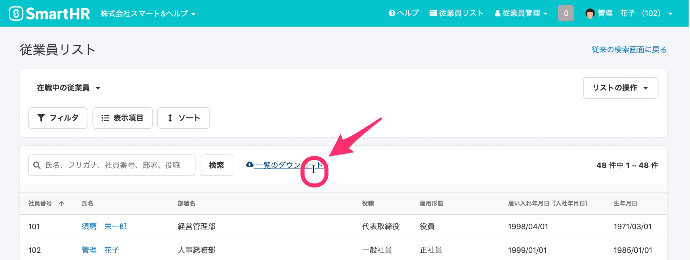
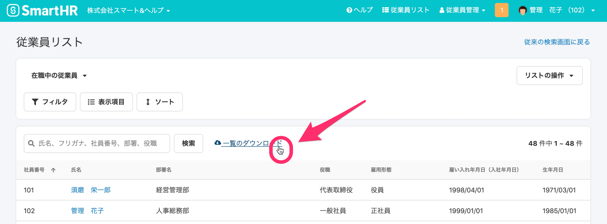

2021年1月12日（月）に行なったアップデートの詳細をお知らせします。

SmartHR基本機能の変更点は、新機能2件・カイゼン3件・不具合修正1件でした。

# ✨ 新機能

## お知らせ機能を利用できるプランを変更しました

これまで期間限定で、0円プラン・スモールプラン・スタンダードプラン・プロフェッショナルプランの全プランでお知らせ機能をご利用いただけましたが、特別期間が終了したため、スタンダードプラン・プロフェッショナルプランのみご利用できる機能となりました。

:::related
[【お知らせ掲示板機能】 0円プラン・スモールプランでの利用は2021年1月11日（月）までとなります](https://smarthr.jp/update/22102)
:::

お知らせ機能の活用方法については、下記のページをご覧ください。

:::related
[従業員向けにお知らせを掲載する](https://knowledge.smarthr.jp/hc/ja/articles/360046721914)
:::

## SmartHR APIで、役職マスタ（JobTitle） と 給与支給形態マスタ（PaymentPeriod） のアクセス制限を設定する UI を追加しました

SmartHR APIで、役職マスター情報と給与支給形態マスター情報を取得・参照できるようにしました。

:::related
[API Specifications - SmartHR for Developers](https://developer.smarthr.jp/api/index.html)
:::

# 📈 カイゼン

## 従業員リストをダウンロードするリンクにカーソルを重ねた際、ポインタが表示されるようにしました

従業員リストをダウンロードするリンク **\[一覧のダウンロード\]** にカーソルを合わせると、ポインタ（指差しアイコン）表示になるようにしました。

| 変更前 |  |
| --- | --- |
| 変更後 |  |

## 大量の源泉徴収票を削除する際の時間を短縮しました

大量の源泉徴収票を削除する際に時間がかかってしまうことがありましたが、今回の改修で削除時間を短縮させました。

## 口座情報を編集した際の監査ログのUIをカイゼンしました

口座情報を編集した際に、監査ログに不要な表示が入っていましたが、今回の改修で表示させないようにしました。

また、これにともない不要な内部処理を省きパフォーマンスを最適化しました。

:::related
[監査ログとは](https://knowledge.smarthr.jp/hc/ja/articles/360026107494)
[口座情報を管理する](https://knowledge.smarthr.jp/hc/ja/articles/360058045133)
:::

# 👨‍⚕️ 不具合修正

電子申請での提出先情報に関する1件の不具合修正を行ないました。
