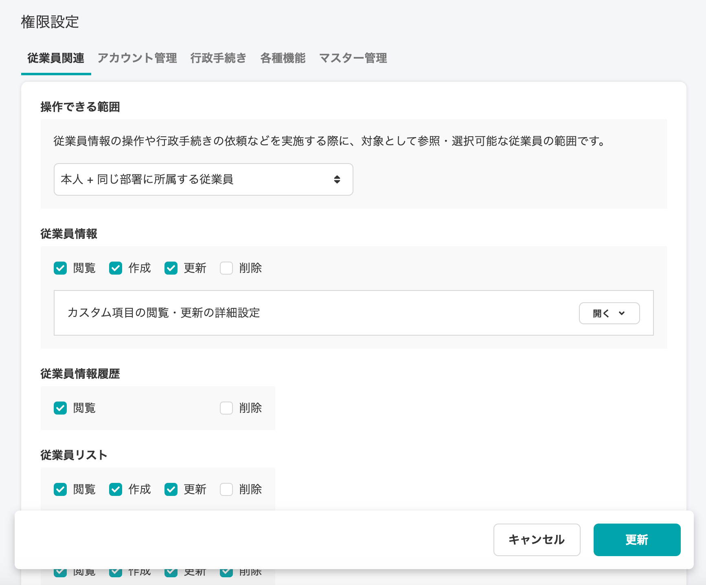
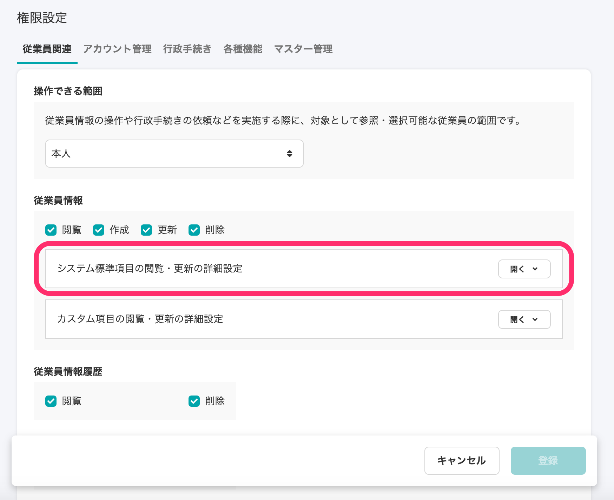
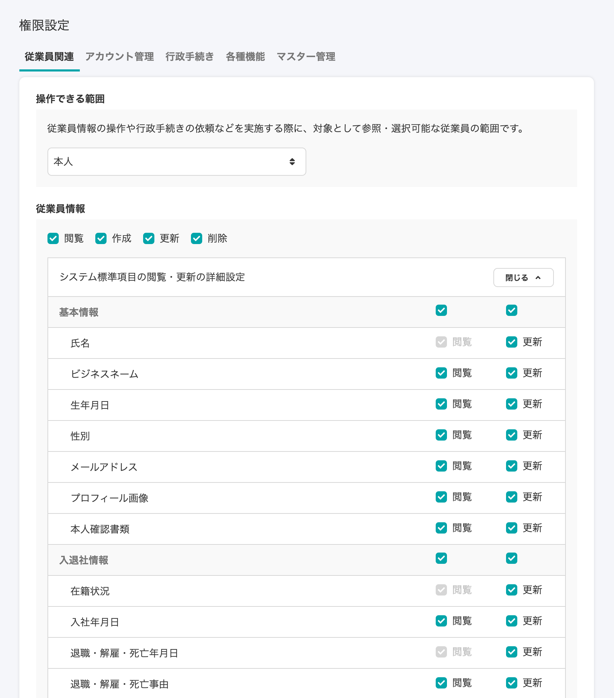
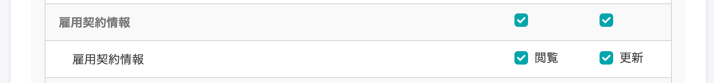
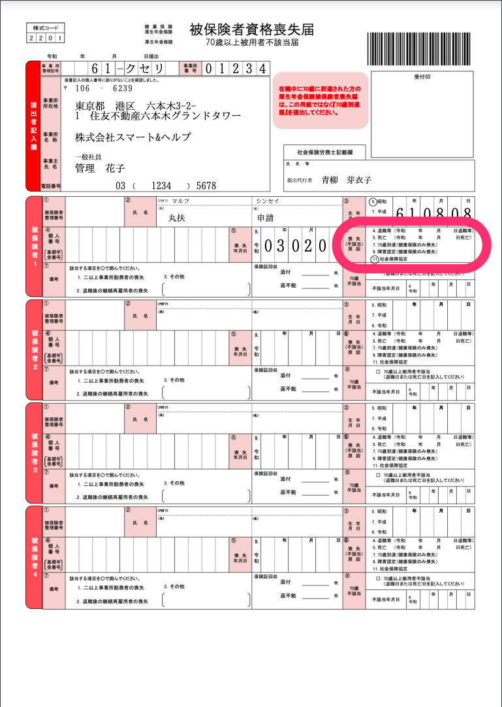
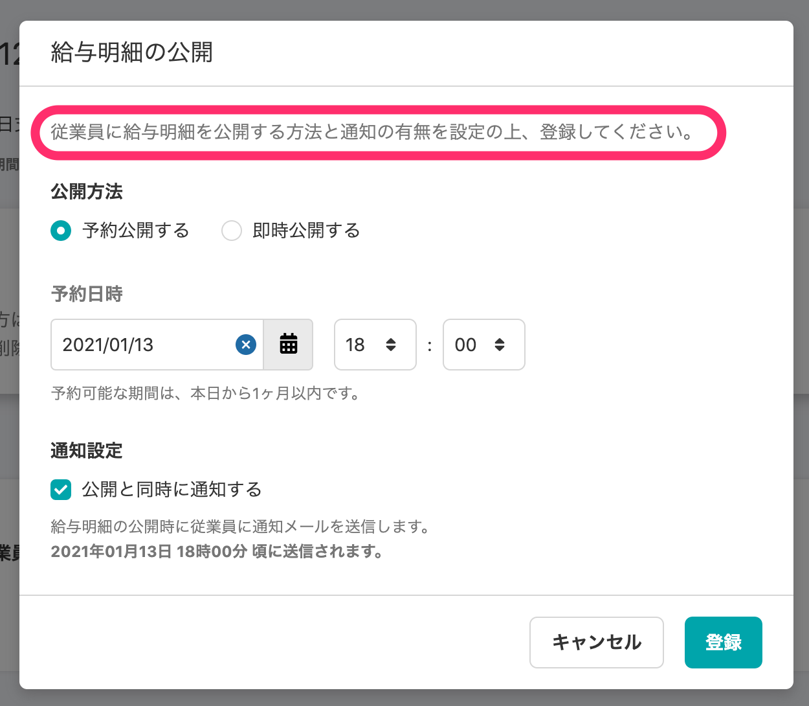
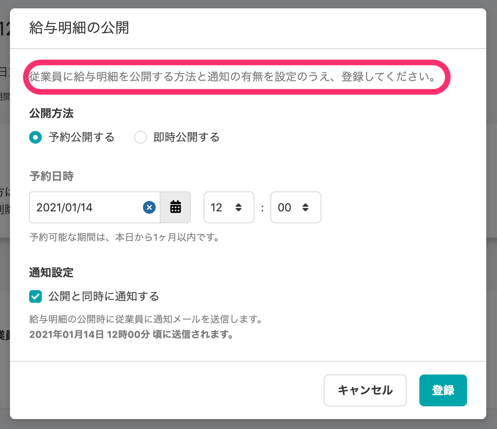

2021年1月13日（水）に行なったアップデートの詳細をお知らせします。

SmartHR基本機能の変更点は、新機能1件・カイゼン2件・不具合修正2件でした。

# ✨ 新機能

## システム標準項目単位で閲覧・更新権限を設定できるようにしました

これまでシステム標準項目の閲覧・更新権限は個別に設定できず、システム標準項目全体の制御になっていました。

今回のリリースで、閲覧・更新権限をシステム標準項目単位で付与できるようになりました。

:::related
[【権限管理機能】従業員情報の項目単位に閲覧・更新権限を付与できるようになります](https://smarthr.jp/update/22207)
:::

設定は、**\[共通設定\] > \[権限\] > \[権限名の右にある編集ボタンをクリック\]****\> \[権限設定\] > \[従業員関連\]** から行ないます。

| 変更前 | 変更後 |
| --- | --- |
|  |  |

**\[システム標準項目の閲覧・更新の詳細設定\]** の **\[開く\]** をクリックすると、各項目の **\[閲覧\] \[更新\]** の設定ができます。

なお、**\[社員番号\] \[氏名\] \[在籍状況\] \[退職予定年月日\] \[事業所\] \[部署\]** の閲覧権限は、仕様上外すことはできません。

また、これまで管理者権限のアカウントでしか閲覧・更新できなかった **\[雇用契約情報\]** を管理者権限以外のアカウントでも閲覧・更新できるようになりました。

:::related
[権限とは](https://knowledge.smarthr.jp/hc/ja/articles/360061864733)
[従業員関連の閲覧・作成・更新・削除の権限を設定する](https://knowledge.smarthr.jp/hc/ja/articles/1500001368101)
:::

# 📈 カイゼン

## 健康保険・厚生年金保険被保険者資格喪失届の様式変更に対応 しました

「健康保険・厚生年金保険被保険者資格喪失届」は令和2年12月1日から様式が変更となり、「喪失（不該当）原因」欄に「社会保障協定による喪失」の項目が追加されました。

それにともない、手続き書類・電子申請の様式変更に対応しました。

**健康保険・厚生年金保険被保険者資格喪失届**

## 給与明細公開設定のダイアログの文言を変更しました

SmartHRの全体での表記を揃えるため、給与明細の公開設定時のダイアログを

**\[従業員に給与明細を公開する方法と通知の有無を設定の上、登録してください。\]** から

**\[従業員に給与明細を公開する方法と通知の有無を設定のうえ、登録してください。\]** に変更しました。

| 変更前 | 変更後 |
| --- | --- |
|  |  |

:::related
[【新デザイン向け】給与明細を確定・公開する](https://knowledge.smarthr.jp/hc/ja/articles/360057942354)
:::

# 👨‍⚕️ 不具合修正

賞与支払届で総括表のみ作成した際の挙動に関する修正など、2件の不具合修正を行ないました。
