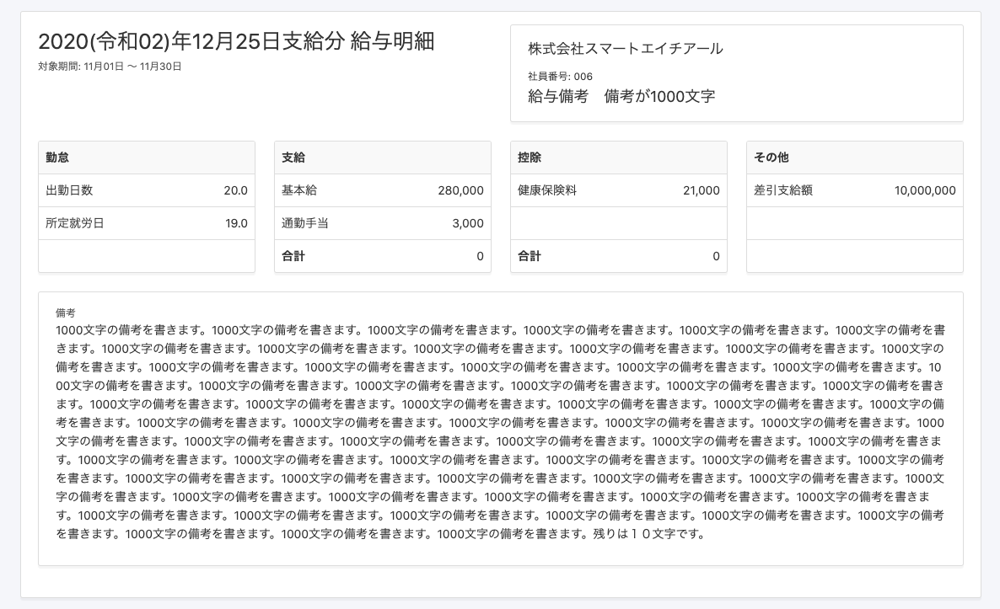
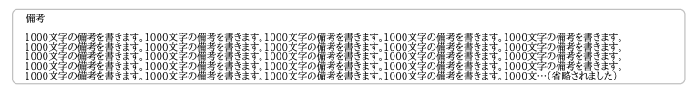

2021年1月18日（月）に行なったアップデートの詳細をお知らせします。

SmartHR基本機能の変更点は、カイゼン2件・不具合修正2件でした。

# 📈 カイゼン

## 給与明細の備考欄の文字数制限を1000文字に変更しました

MoneyForwardの給与明細の備考欄の文字数制限が1000文字のため、SmartHRもそちらに合わせて給与明細の備考欄の文字数制限を、200文字から1000文字に変更しました。

対応箇所は下記のとおりです。

- **Web表示**

- **PDF表示**

1行75文字で改行され、6行以上の場合には末尾に **\[…(省略されました)\]** が記載されます。

:::related
[給与明細の備考欄を使うには？](https://knowledge.smarthr.jp/hc/ja/articles/360039253353)
[発行された給与明細を確認する](https://knowledge.smarthr.jp/hc/ja/articles/360026266213)
:::

## 権限の編集画面の表示を50倍高速化しました

権限の編集画面でカスタム項目が多い場合に処理が遅いことがありましたが、今回の改修でパフォーマンスを最適化し、表示速度を速めました。

# 👨‍⚕️ 不具合修正

ドロップダウン形式のカスタム項目を登録した際の挙動に関する修正など、2件の不具合修正を行ないました。
