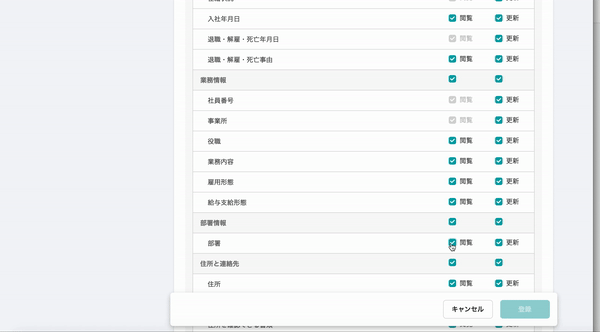
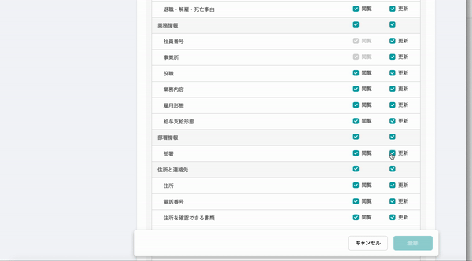
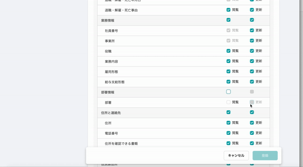
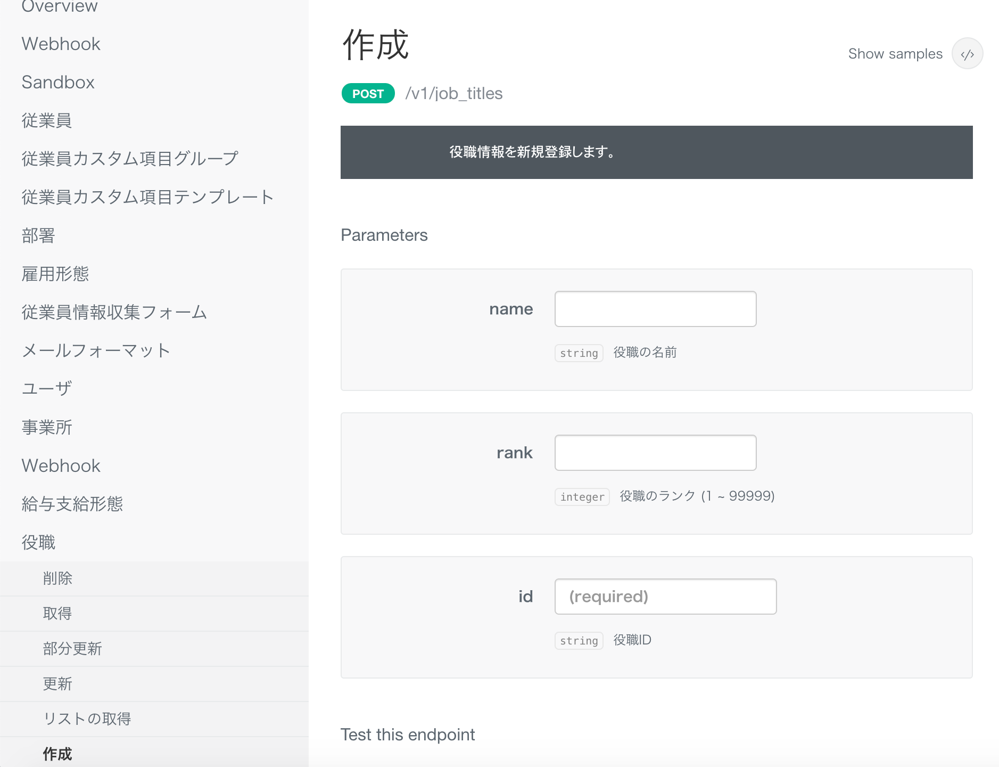
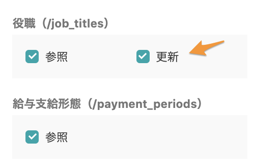

2021年1月19日（火）に行なったアップデートの詳細をお知らせします。

SmartHR基本機能の変更点は、カイゼン3件・不具合修正3件でした。

# 📈 カイゼン

## 権限の操作可能範囲の部署関連設定と、部署項目の更新権限を紐づかせました

権限を設定する際の **\[従業員関連\] > \[操作できる範囲\]** を「本人」もしくは「全従業員」から「部署関連」に変更した場合、これまでは、従業員情報の部署項目の **\[更新\]** のチェックボックスが意図せず外れてしまっていました。

今回のカイゼンで、 **\[操作できる範囲\]** を「部署関連」にした場合に、部署項目の **\[閲覧\]** はチェックボックスにチェックがついたまま固定され、**\[更新\]** はチェックのつけ外しが任意でできる仕様になります。

:::tips
今回のリリースノートにおける **\[操作できる範囲\]** の「部署関連」とは、以下の選択肢です。
- \[本人＋同じ部署とその配下の部署に所属する従業員\]
- \[本人＋同じ部署に所属する従業員\]
- \[本人＋配下の部署に所属する従業員\]
:::

以下に操作例を紹介します。

### 部署の**\[閲覧\]** ／ **\[更新\]** にチェックがついている場合

- 本人／全従業員 → 部署関連への操作範囲の変更
    - **\[閲覧\]** がチェックありでグレーアウトし、**\[更新\]** 権限はチェックが入ったまま維持されています。
- 部署関連→ 本人／全従業員への操作範囲の変更
    - チェックボックスの状態が維持されています。（閲覧・更新権限ともにチェックが入ったまま維持）

### 部署の**\[閲覧\]** チェックあり ／ **\[更新\]** チェックなしの場合

- 本人／全従業員→部署関連への操作範囲の変更
    - **\[閲覧\]** にチェックが入ったままグレーアウトし、**\[更新\]** はチェックなしのまま維持されています。
- 部署関連→ 本人／全従業員への操作範囲の変更
    - チェックボックスの状態が維持されています。（閲覧チェックあり／更新チェックなしで維持）

### 部署の **\[閲覧\] ／ \[更新\]** にどちらもチェックが入ってない場合

- 本人／全従業員→部署関連への操作範囲に変更
    - **\[閲覧\]** にチェックが入ってグレーアウトした状態になり、**\[更新\]** にはチェックがついていません。

## SmartHR APIで役職マスタのAPIに、POST（作成）、PUT（更新）、PATCH（部分更新）、 DELETE（削除）を追加しました

役職マスタの API に POST（作成）、PUT（更新）、 PATCH（部分更新）、DELETE（削除） を追加しました。

また、アクセストークンページの役職マスタ情報に **\[更新\]** 権限をつけられるようにしました。

:::related
[API Specifications - SmartHR for Developers](https://developer.smarthr.jp/api/index.html)
:::

## 源泉徴収の詳細画面の表示を高速化しました

従業員が多数登録された源泉徴収の詳細画面の表示に時間がかかることがありましたが、今回の改修でパフォーマンスを最適化し、表示速度を速めました。

# 👨‍⚕️ 不具合修正

監査ログでの口座情報の画像表示に関する1件の不具合修正を行ないました。
