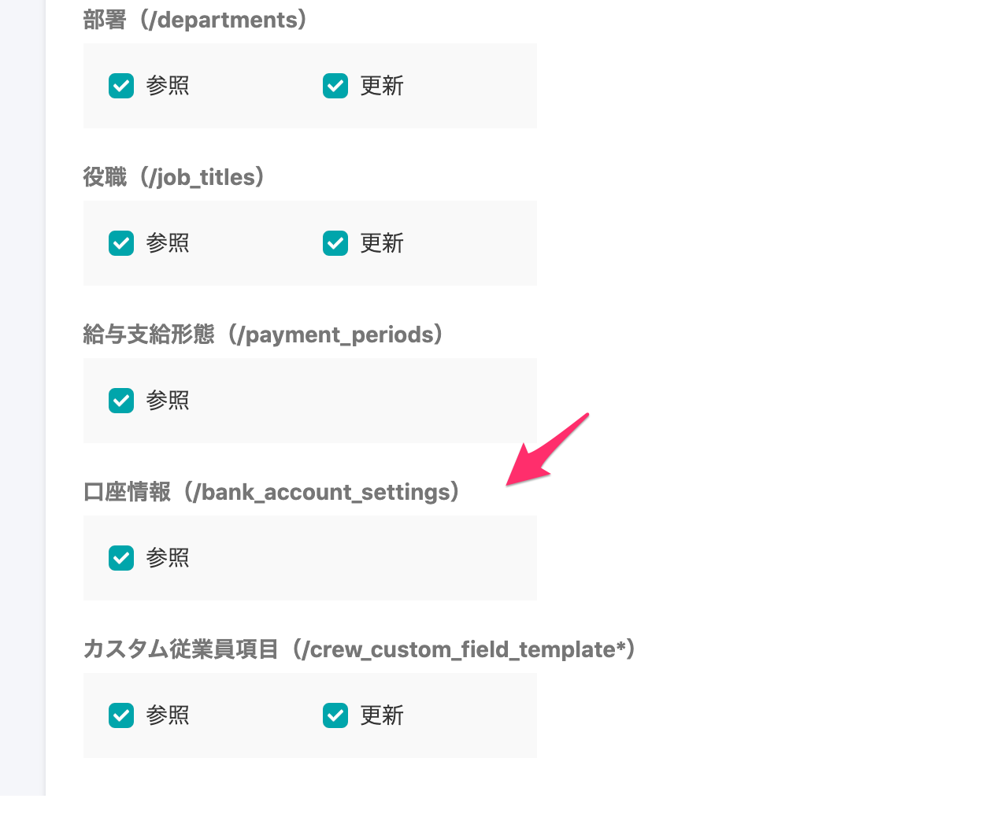
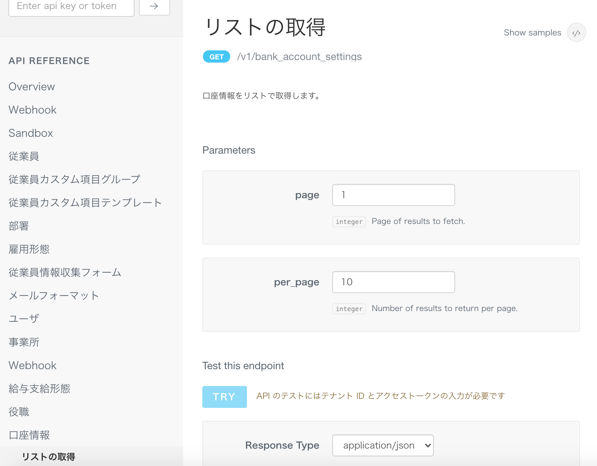

2021年1月20日（水）に行なったアップデートの詳細をお知らせします。

SmartHR基本機能の変更点は、新機能1件・カイゼン1件・不具合修正2件でした。

# ✨ 新機能

## 口座情報マスターをAPIで参照できるようにしました

これまで、口座情報マスターはAPIで参照できませんでしたが、今回の改修で、参照できるようにしました。

それにともない、アクセストークンの設定で、口座情報の **\[参照\]** 権限をつけられるようにしました。

:::related
[口座情報を管理する](https://knowledge.smarthr.jp/hc/ja/articles/360058045133)
:::

口座情報マスターのAPIの仕様は、SmartHR APIのページをご覧ください。

:::related
[API Specifications - SmartHR for Developers](https://developer.smarthr.jp/api/index.html)
:::

# 📈 カイゼン

## 健康保険・厚生年金保険被保険者資格喪失届の様式変更に対応 しました（電子申請編）

「健康保険・厚生年金保険被保険者資格喪失届」は令和2年12月1日から様式が変更となり、「喪失（不該当）原因」欄に「社会保障協定による喪失」の項目が追加されました。

それにともなう、e-govの電子申請の様式変更に対応しました。

書類の様式変更には、1月13日のリリースで対応しています。

:::related
[健康保険・厚生年金保険被保険者資格喪失届の様式変更に対応しました｜2020/01/13 システム標準項目単位で閲覧・更新権限を設定できるようにしました 他4件](https://knowledge.smarthr.jp/hc/ja/articles/1500001577082-2020-01-13-%E3%82%B7%E3%82%B9%E3%83%86%E3%83%A0%E6%A8%99%E6%BA%96%E9%A0%85%E7%9B%AE%E5%8D%98%E4%BD%8D%E3%81%A7%E9%96%B2%E8%A6%A7-%E6%9B%B4%E6%96%B0%E6%A8%A9%E9%99%90%E3%82%92%E8%A8%AD%E5%AE%9A%E3%81%A7%E3%81%8D%E3%82%8B%E3%82%88%E3%81%86%E3%81%AB%E3%81%97%E3%81%BE%E3%81%97%E3%81%9F-%E4%BB%964%E4%BB%B6)
:::

# 👨‍⚕️ 不具合修正

労働保険の年度更新手続きに関する修正など、2件の不具合修正を行ないました。
