2021年1月25日（月）に行なったアップデートの詳細をお知らせします。

SmartHR基本機能の変更点は、新機能1件・カイゼン5件・不具合修正2件でした。

# ✨ 新機能

## 給与明細を従業員ごとに「追加・修正・削除」できるようにしました

一度取り込んだ給与明細を、従業員ごとに、追加・修正・削除できるようにしました。

:::related
[【1/25更新】給与明細一覧を従業員ごとに追加・修正できるようになりました](https://smarthr.jp/update/22246)
:::

また、給与明細一覧の新デザイン画面と従来のデザイン画面を併用して使用できる期間を終了し、正式に新デザインに移行しました。

:::related
[【11月27日更新】給与明細管理画面がデザイン変更・機能追加されます](https://smarthr.jp/update/21138)
:::

### 追加・更新

**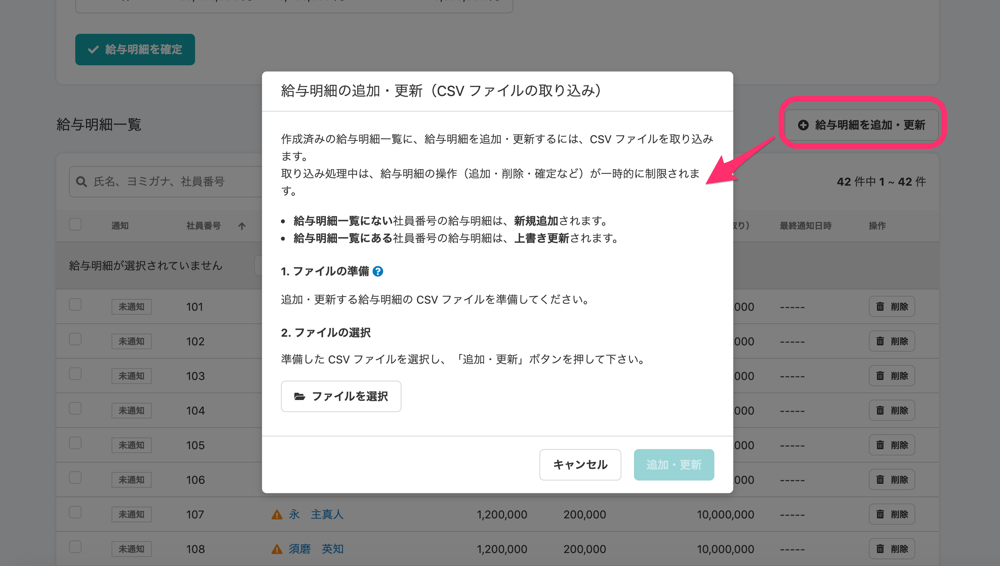**

### 削除

- **一人ずつ削除**

**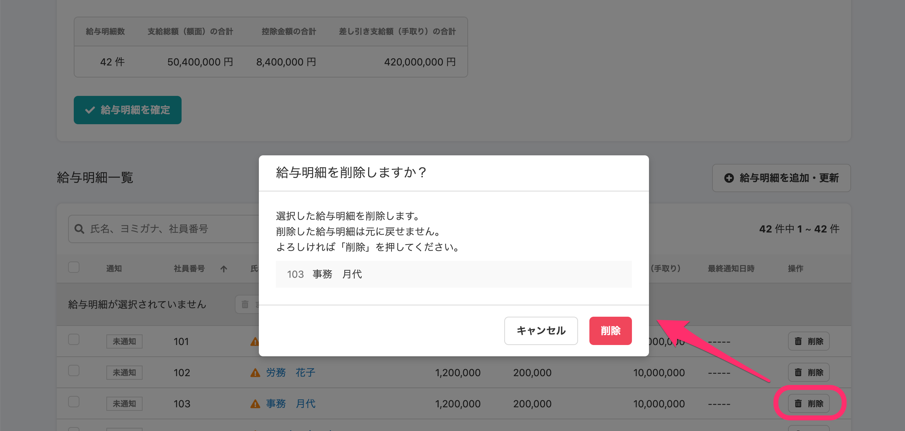**

- **選択してまとめて削除**

**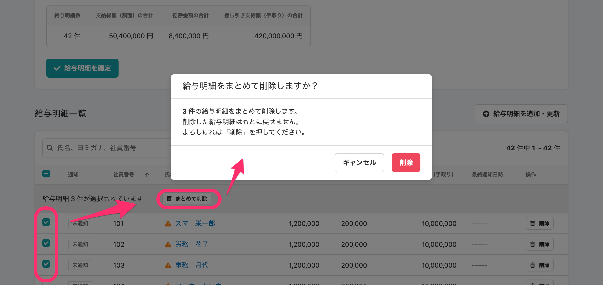**

### 確定解除

**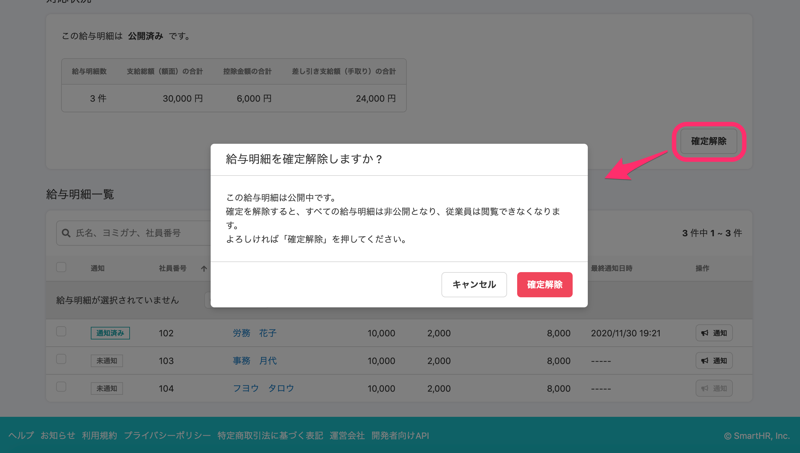**

:::related
**[給与明細を追加・更新・削除する](https://knowledge.smarthr.jp/hc/ja/articles/360026264973)**
:::

# 📈 カイゼン

## 申請を承認した際のフラッシュメッセージのアイコンの色を変更しました

申請を承認した際のフラッシュメッセージのアイコンを、グレーから緑色に変更しました。

| 変更前 | 変更後 |
| --- | --- |
| 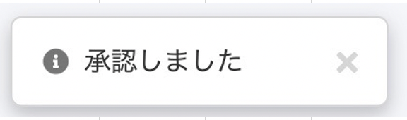 | 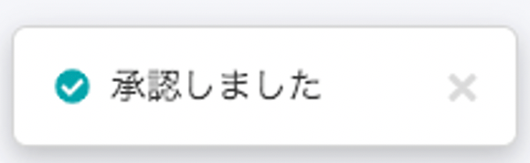 |

## 給与明細の合計エラーを、取り込み中画面でも表示するようにしました

これまで給与明細一覧の画面で合計金額が一致していない際は、未確定の時だけエラーメッセージを表示していました。

こちらを今回の新機能リリースにともない、追加で取り込みをした際にもエラーメッセージを表示するようにしました。

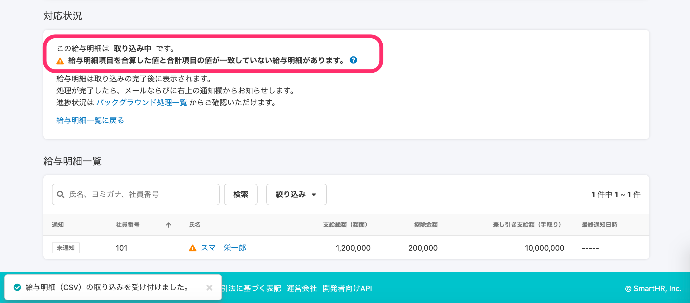

:::related
[給与明細に \[！\] アイコンが表示されるのはなぜ？](https://knowledge.smarthr.jp/hc/ja/articles/360026264333)
:::

## 給与明細グループ一覧のラベルデザインを変更しました

これまで、給与明細のトップページで表示される給与明細一覧のラベルが、**\[確定済\] \[公開済\]**が同じ色で区別がつきづらいものでした。

今回の改修で、ラベルデザインを変更し、各ステータスの区別をつけやすくしました。

| 変更前 | 変更後 |
| --- | --- |
| 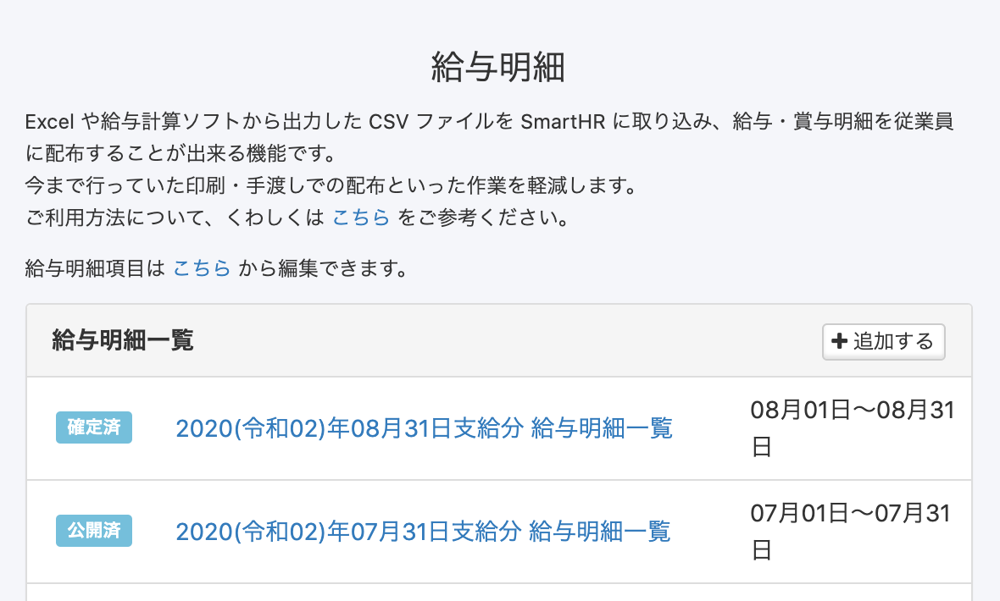 | 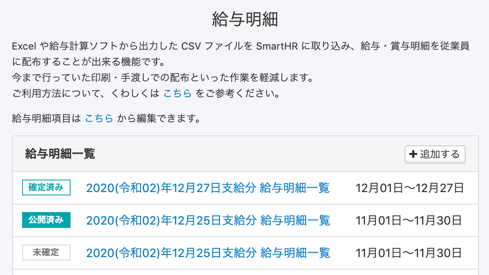 |

## 分析レポート機能に、給与明細のその他項目を反映させました

分析レポートでデータ同期をした際に、給与明細のその他項目も反映されるようにしました。

## 給与明細追加ボタンのアイコンサイズを変更しました

SmartHR全体でデザインを統一させるため、**\[給与明細を追加・更新\]** ボタンのアイコンサイズを大きくしました。

| 変更前 | 変更後 |
| --- | --- |
| 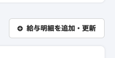 | 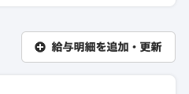 |

# 👨‍⚕️ 不具合修正

SALM SSO連携に関する修正など、2件の不具合修正を行ないました。
