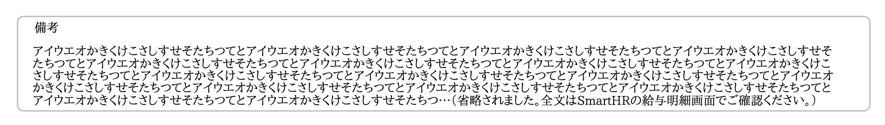

2021年1月26日（火）に行なったアップデートの詳細をお知らせします。

SmartHR基本機能の変更点は、カイゼン1件・不具合修正1件でした。

# 📈 カイゼン

## 給与明細PDFの備考欄の省略メッセージを変更しました

2021年1月18日のリリースで給与明細の備考欄は1000文字まで入力できるようになり、PDFで表示させた際に75文字×6行以上になると備考欄が省略される仕様になりました。

今回の改修でその省略メッセージを、 **\[省略されました\]** から **\[省略されました。全文はSmartHRの給与明細画面でご確認ください。\]** に変更しました。

:::related
[2020-01-18-給与明細の備考欄の文字数制限を1000文字に変更しました-他3件](https://knowledge.smarthr.jp/hc/ja/articles/360060294254)
:::

| 変更前 |  |
| --- | --- |
| 変更後 |  |

:::related
[給与明細の備考欄を使うには？](https://knowledge.smarthr.jp/hc/ja/articles/360039253353)
[発行された給与明細を確認する](https://knowledge.smarthr.jp/hc/ja/articles/360026266213)
:::

# 👨‍⚕️ 不具合修正

源泉徴収票一覧のラベル表示に関する1件の不具合修正を行ないました。
