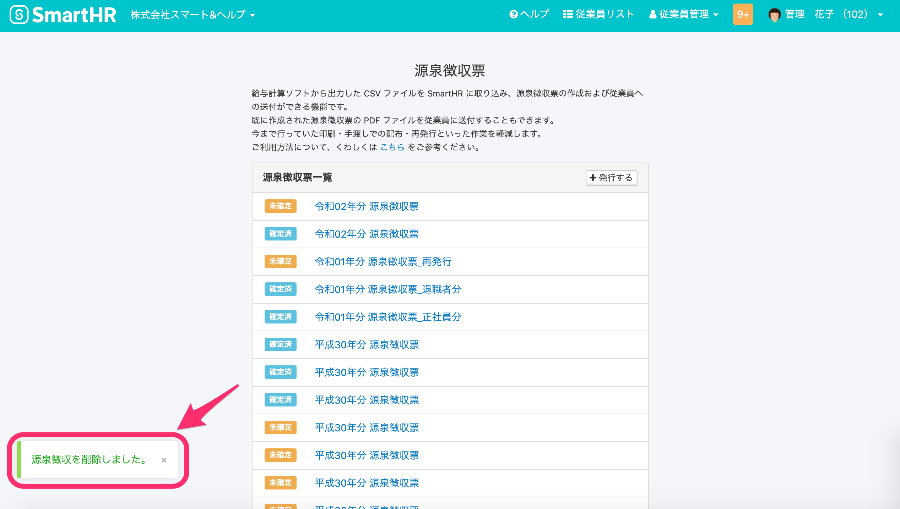

2021年2月2日（火）に行なったアップデートの詳細をお知らせします。

SmartHR基本機能の変更点は、カイゼン2件・不具合修正2件でした。

# 📈 カイゼン

## 従業員リストの \[一覧のダウンロード\] リンクをボタンデザインに変更しました

Smart HR全体のデザインルールに合わせ、従業員リストの **\[一覧のダウンロード\]** リンクを、水色のテキストから黒のボタンに変更しました。

| 変更前 |  |
| --- | --- |
| 変更後 |  |

## 源泉徴収票の削除の際の挙動をカイゼンしました

これまで源泉徴収票を削除する際、対象従業員数が多いと処理に時間がかかり画面がタイムアウトすることがありました。

そのため今回の改修で、源泉徴収票の削除はバックグラウンド処理で実行させるようにし、タイムアウトさせないようにしました。

源泉徴収票削除操作をした際の挙動の変更点は下記のとおりです。

- 画面下に表示されるメッセージを **\[源泉徴収票を削除しました。\]** から **\[{源泉徴収票の名前}の削除が予約されました。\]** に変更
- 削除中の案内文とバックグラウンド処理一覧へのリンクを表示

| 変更前 |  |
| --- | --- |
| 変更後 |  |

バックグラウンド処理結果画面

# 👨‍⚕️ 不具合修正

扶養追加手続きのマイナンバー再提出での挙動に関する修正など、2件の不具合修正を行ないました。
