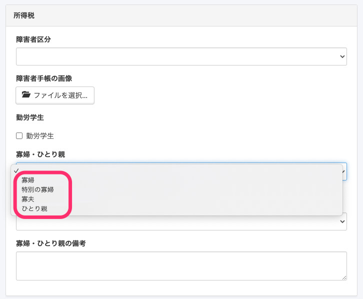
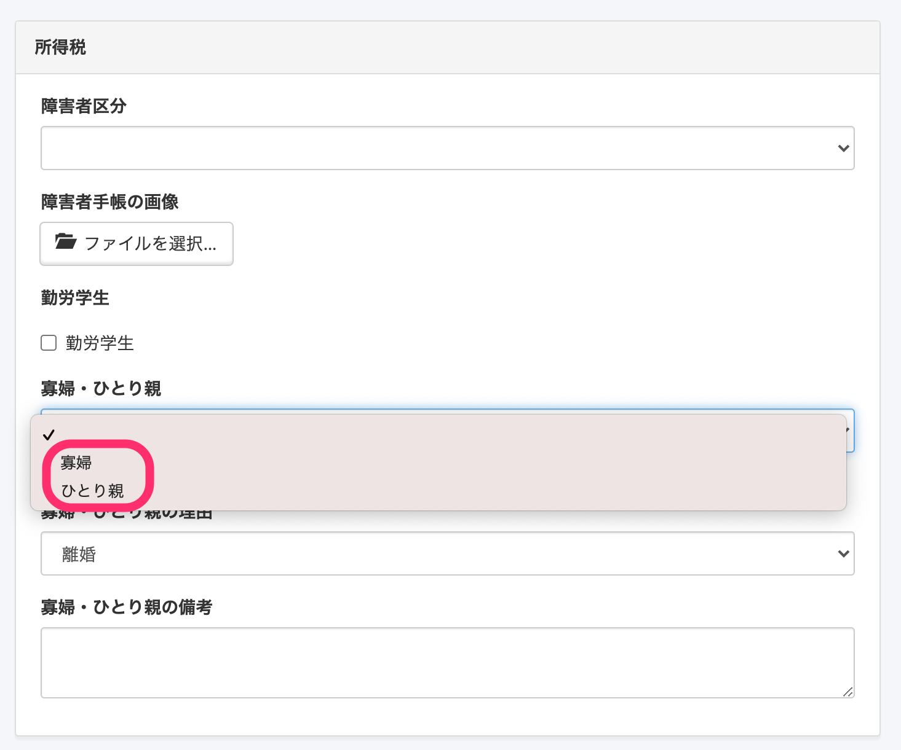
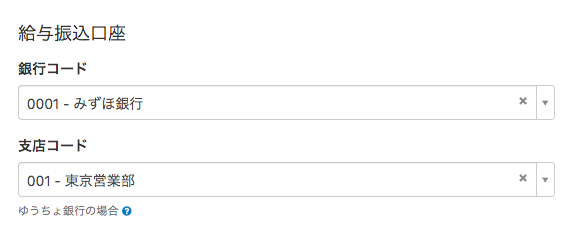
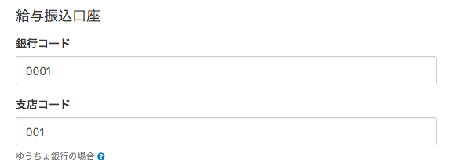

2021年2月4日（木）に行なったアップデートの詳細をお知らせします。

SmartHR基本機能の変更点は、カイゼン2件でした。

# 📈 カイゼン

## \[寡婦・ひとり親\] 項目の選択肢から \[特別の寡婦\]・\[寡夫\] を削除しました

令和2年度税制改正にともない、 従業員情報の所得税の欄にある **\[寡婦・ひとり親\]** 項目の選択肢から **\[特別の寡婦\]** と **\[寡夫\]** を廃止しました。

これまで **\[寡夫・ひとり親\]** 項目が **\[特別の寡婦\]**または **\[寡夫\]** として登録されていた場合は、 **\[未選択\]** の状態になります。

:::related
[「特別の寡婦」「寡夫」の廃止に伴う登録済情報の変更に関するお知らせ](https://smarthr.jp/update/22362)
:::

| 変更前 |  |
| --- | --- |
| 変更後 |  |

**\[寡夫・ひとり親\]**項目の状態の確認方法と従業員情報の更新方法については、下記のページをご覧ください。

:::related
[「特別の寡婦」「寡夫」の廃止に伴い、従業員情報を確認・変更する](https://knowledge.smarthr.jp/hc/ja/articles/1500001400982)
:::

## \[銀行コード\] の入力を残すようにしました

これまで従業員情報の口座情報で、 **\[銀行コード\]** の数字を入力した際に銀行情報が正しく反映されない場合は、コードの入力が消える仕様になっていました。

この仕様だと情報が保存できないことや、誤ったデータが保存されてしまう懸念があったため、 今回の改修で、**\[銀行コード\]** の入力はそのまま表示させるようにしました。

- **銀行情報が反映されている場合**

- **銀行情報が反映されていない場合**

