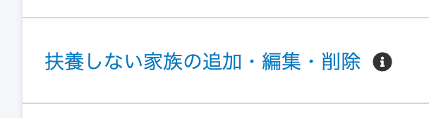
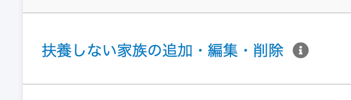
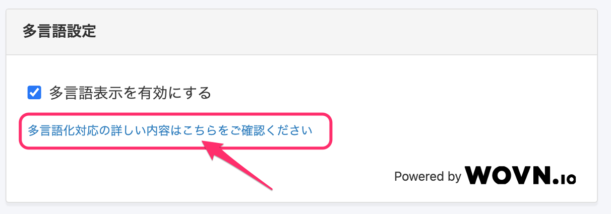
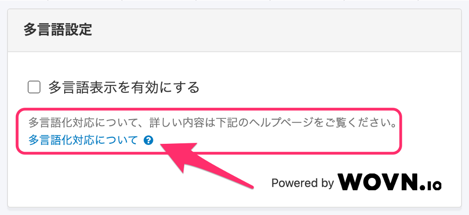
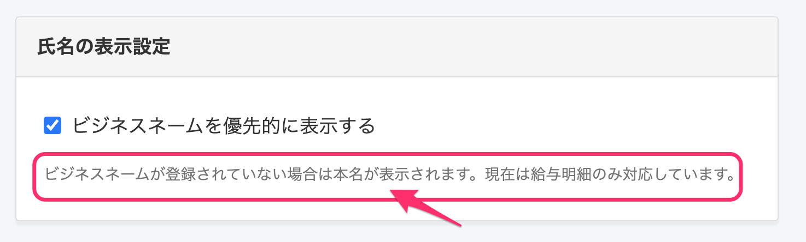
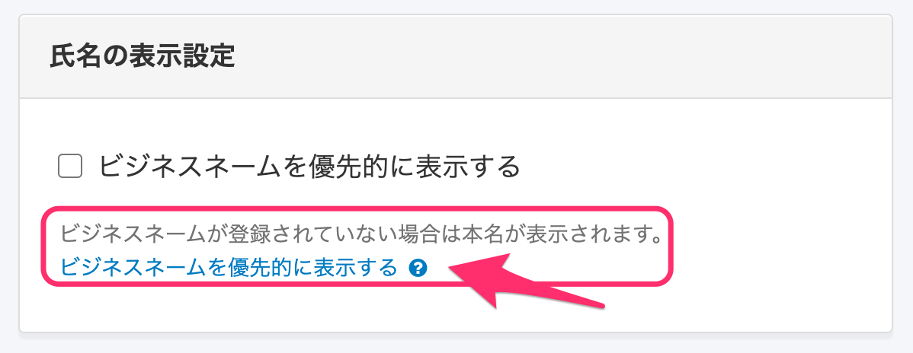

2021年2月8日（月）に行なったアップデートの詳細をお知らせします。

SmartHR基本機能の変更点は、カイゼン2件・アクセシビリティ1件・不具合修正2件でした。

# 📈 カイゼン

## 申請のインフォメーションアイコンのカラーを変更しました

SmartHR全体のデザインルールに合わせるため、**\[共通設定\] > \[申請\]** のフォーム名横にあるインフォメーションアイコンのカラーを薄いグレーに変更しました。

| 変更前 | 変更後 |
| --- | --- |
|  |  |

## 従業員数と項目数が多い場合の給与明細詳細画面の表示を高速化させました

これまでは従業員数と項目数が多い場合に、給与明細の詳細画面の表示に時間がかかってしまうことがありましたが、 今回の改修で詳細画面の表示速度を速めました。

# 🎢 アクセシビリティ

## \[全般設定\] の説明文2箇所を変更しました

**\[共通設定\]** \> **\[全般設定\]** > **\[多言語設定\] ／** **\[氏名の表示設定\]** の2箇所を下記のとおり変更しました。

- **\[多言語設定\]** の説明リンク

Smart HR全体の表記ルールに合わせて、**\[多言語化対応の詳しい内容はこちらをご覧ください\]** から **\[多言語化対応について、詳しい内容は下記のヘルプページをご覧ください\]** とし、**\[多言語化対応について\]** のヘルプページのタイトルを表記しました。

| 変更前 |  |
| --- | --- |
| 変更後 |  |

- **\[氏名の表示設定\]** の説明箇所

**\[現在は給与明細のみ対応しています。\]** の一文を削除し、 **\[ビジネスネームを優先的に表示する\]** のヘルプページへのリンクを設置し、詳細な設定情報を見られるようにしました。

| 変更前 |  |
| --- | --- |
| 変更後 |  |

# 👨‍⚕️ 不具合修正

「雇用保険資格喪失届」の電子申請取下げ時の挙動に関する修正など、2件の不具合修正を行ないました。
