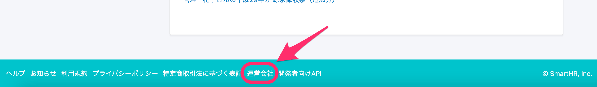

2021年2月9日（火）に行なったアップデートの詳細をお知らせします。

SmartHR基本機能の変更点は、カイゼン1件・不具合修正1件でした。

# 📈 カイゼン

## フッターの \[運営会社\] のリンクを別タブで開くようにしました

これまでフッターにある **\[運営会社\]** のリンクをクリックすると、同じタブでリンク先のページが開くようになっていましたが、今回の改修で別タブでリンク先のページを開くようにしました。

# 👨‍⚕️ 不具合修正

高年齢雇用継続給付申請（2回目以降）の、電子申請取下げ時の挙動に関する1件の不具合修正を行ないました。
