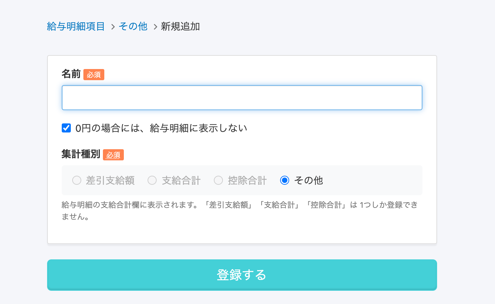
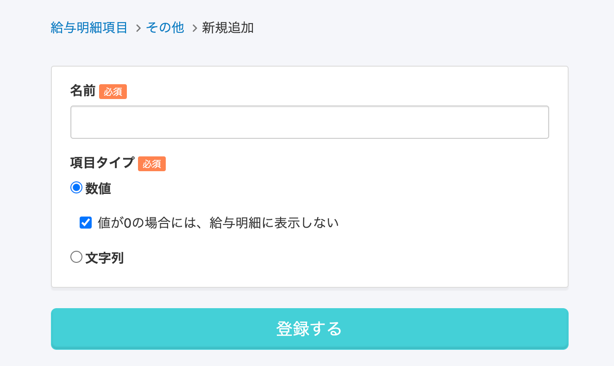
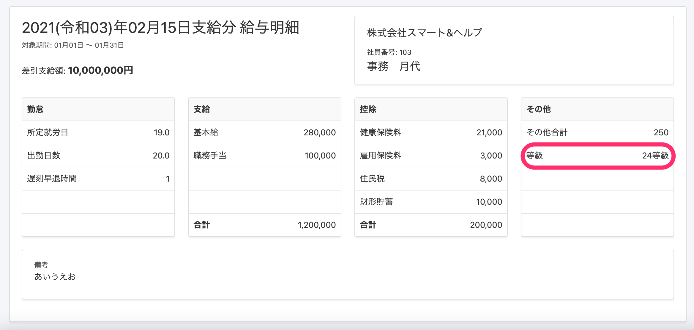
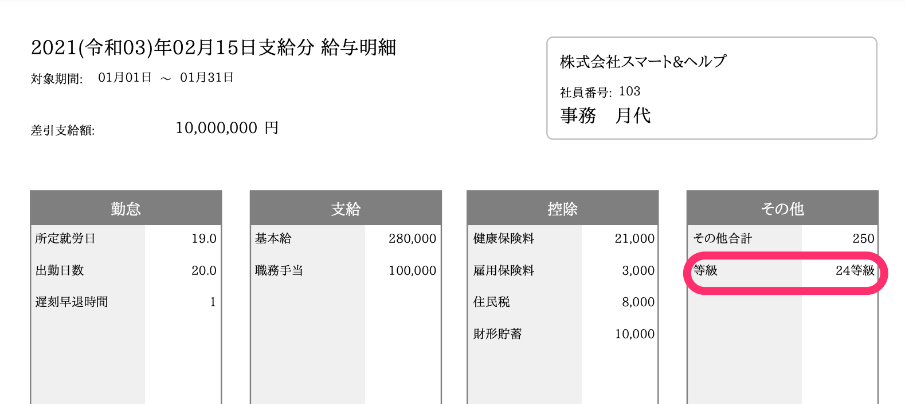

2021年2月10日（水）に行なったアップデートの詳細をお知らせします。

SmartHR基本機能の変更点は、カイゼン2件でした。

# 📈 カイゼン

## 給与明細のその他項目の値に文字列を登録できるようにしました

これまでは給与明細の **\[その他\]** 項目は **\[数値\]** のみを登録できましたが、今回のリリースで値として **\[数値\]** か **\[文字列\]** を選択できるようにしました。

項目タイプとして **\[文字列\]** を選択すると、値として文字列が登録ができるようになります。

| 変更前 | 変更後 |
| --- | --- |
|  |  |

**給与明細Web表示**

**給与明細PDF表示**

:::related
[給与明細項目を設定する](https://knowledge.smarthr.jp/hc/ja/articles/360026265193)
:::

## 口座情報を空のまま保存するようにしました

これまで従業員情報の口座情報を「ブランクで更新」すると、内部的には「削除」が行なわれ、空の情報は保存されませんでした。

この仕様だと「削除」が履歴の一連性を失わせ不具合の原因になっていたため、今回の改修でブランクで更新しても空のまま保存するようにしました。
