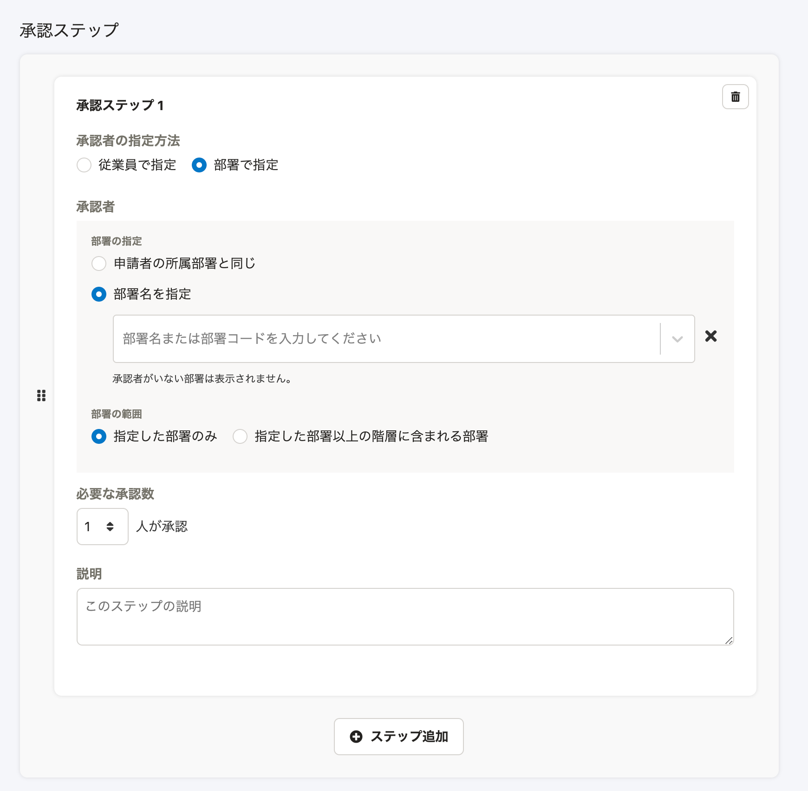

2021年2月16日（火）に行なったアップデートの詳細をお知らせします。

SmartHR基本機能の変更点は、新機能1件・カイゼン2件でした。

# ✨ 新機能

## 承認経路の承認者を部署で指定できるようにしました

これまで申請の承認経路は承認者を1人ずつ指定する必要がありましたが、今回のアップデートにより部署を基準に承認者を指定できるようにしました。

:::related
[【申請機能】承認者を部署で指定して承認経路を作成できるようになります](https://smarthr.jp/update/22834)
:::

**\[共通設定\] > \[申請\] > \[経路\]**の画面から設定できます。

**\[部署の指定\]** は、 **\[申請者の所属部署と同じ\]** ・ **\[部署名を指定\]** の2種類の指定方法があります。

| 変更前 | 変更後 |
| --- | --- |
|  |  |

詳しい機能の説明は、下記のヘルプページをご覧ください。

:::related
[承認者を部署を基準に指定する](https://knowledge.smarthr.jp/hc/ja/articles/360061287294)
:::

# 📈 カイゼン

## 従業員情報の一括登録・更新の時間を短縮しました

これまでは、従業員情報の一括登録・更新を行なった際、カスタム従業員項目が多く登録されている場合などで時間がかかってしまうことがありましたが、今回の改修でパフォーマンスを最適化し、速度をカイゼンしました。
