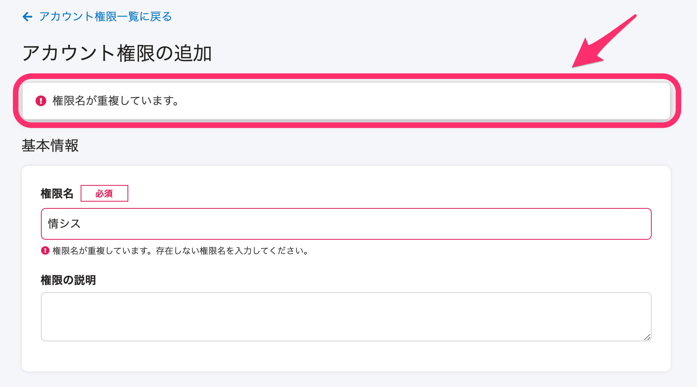
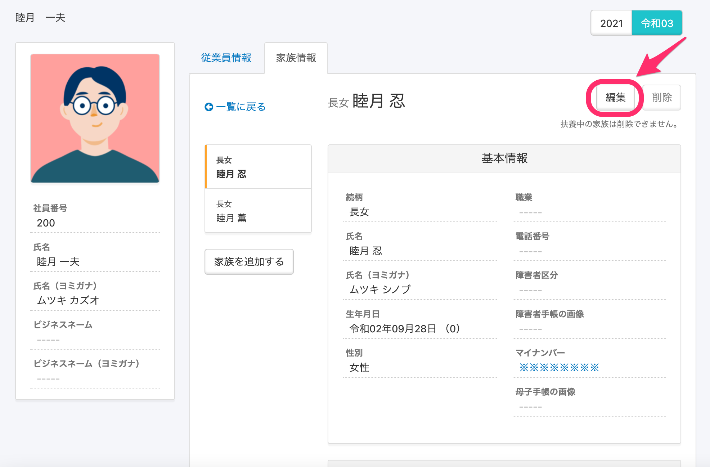

2021年2月17日（水）に行なったアップデートの詳細をお知らせします。

SmartHR基本機能の変更点は、カイゼン2件・不具合修正3件でした。

# 📈 カイゼン

## 重複した権限名を登録しようとした際に、インフォパネルを表示するようにしました

**\[権限名\]** がすでに登録されている名前と重複している場合は、登録・更新しようとした際に、インフォパネルを出すようにしました。

## 権限の \[操作できる範囲\] が \[本人\] でも自分の家族情報は更新できるようにしました

これまでは **\[権限設定\]** の **\[操作できる範囲\]** が **\[本人\]** の場合、**\[****家族情報\]** の **\[更新\]** 権限を付けていてもプロフィール画面から直接自分の家族情報に追加や更新ができず、手続きや申請を経由しないといけませんでした。

今回の改修で、**\[操作できる範囲\]** が **\[本人\]** の場合でも、**\[家族情報\]** の **\[更新\]** 権限がある場合は自分のプロフィール画面から、家族情報の追加・編集・削除をできるようにしました（扶養している家族の情報は削除できません。）

- 操作できる範囲：本人 + 家族情報の更新権限がある場合

# 👨‍⚕️ 不具合修正

特定の条件下で従業員招待フォームのカスタム項目を入力した際の挙動に関する修正など、3件の不具合修正を行ないました。
