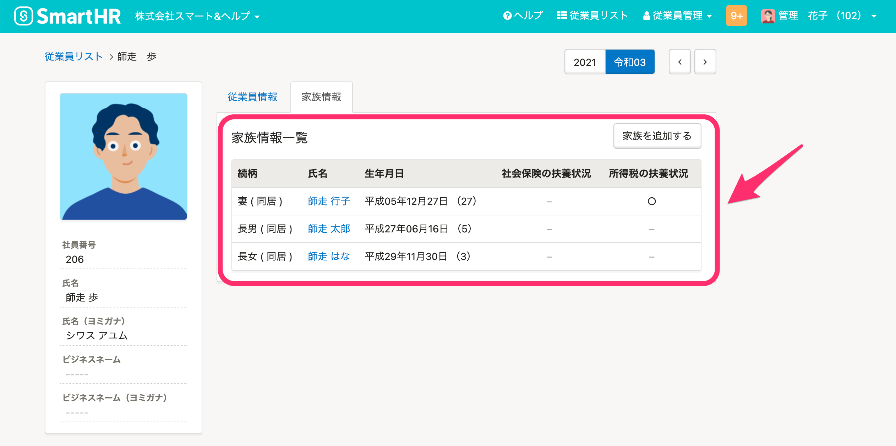
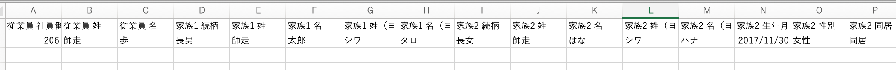
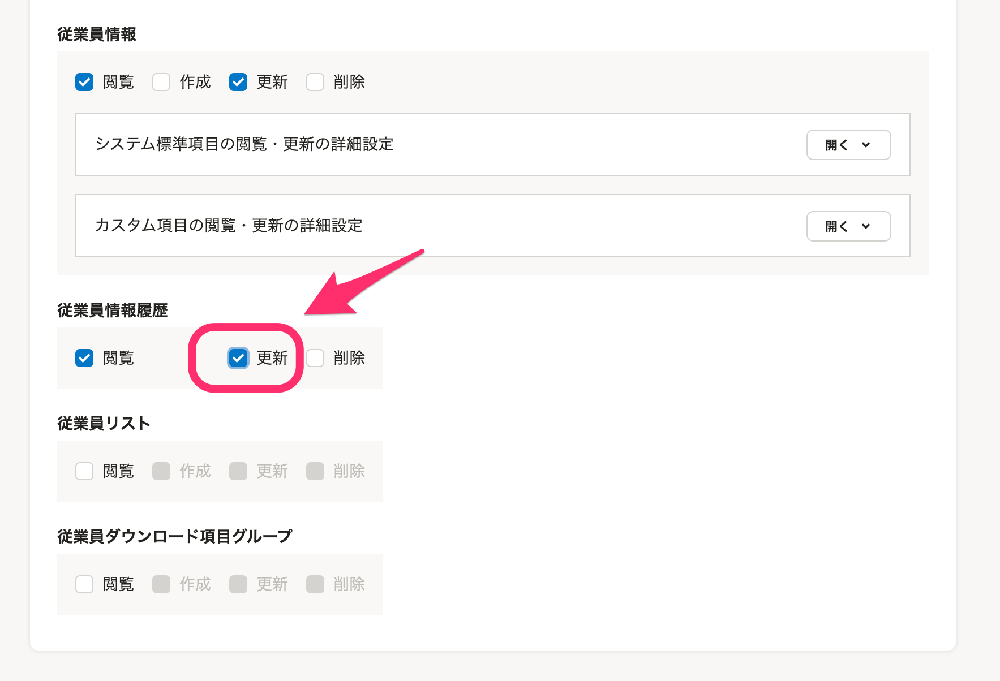
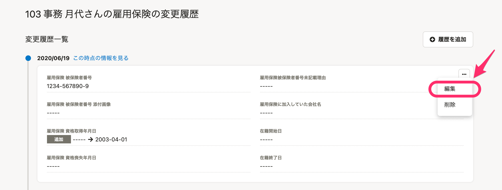
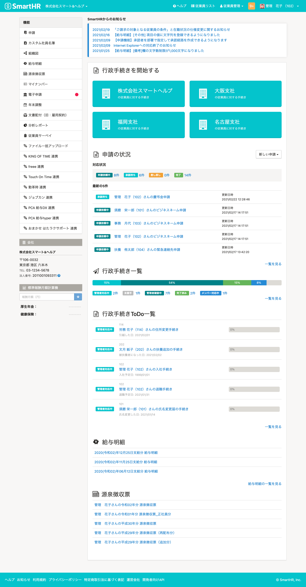

2021年2月24日（水）に行なったアップデートの詳細をお知らせします。

SmartHR基本機能の変更点は、カイゼン3件・アクセシビリティ1件・不具合修正2件でした。

# 📈 カイゼン

## 家族情報をダウンロードした際の家族の表示順を \[家族情報一覧\] 画面と合わせました

これまでは、家族情報をダウンロードした際にファイルに表示される家族情報は順不定でした。

今回の改修で、ダウンロードファイルの家族情報の表示順を、 **\[家族情報一覧\]** の表示順と同様に「登録した順」に表示させるようにしました。

| 家族情報一覧 |  |
| --- | --- |
|   ダウンロードした  ファイル   |  |

## 申請の作成画面の表示を速くしました

従業員情報でカスタム項目が大量にある場合、申請フォームの項目数に関わらず申請を作成する画面を開くのに時間がかかってしまうことがありました。

そのため今回の改修で表示を高速化しました。

## 履歴直接編集の権限設定をできるようにしました

これまで **\[権限設定\]** > **\[従業員情報\]** の更新権限がある場合は、従業員が履歴の直接編集をできるため、管理者が意図・把握しない履歴操作が行なわれる懸念がありました。

そのため今回の改修で、 **\[従業員情報履歴\]** の更新権限を設け、従業員情報の更新とは別に権限を設定できるようにし、管理者が把握しない操作が行まわれるのを防ぐようにしました。

こちらのカイゼンは、履歴の編集が可能なスタンダードプラン・プロフェッショナルプランが対象になります。

**\[権限設定\]** > **\[従業員関連\]** > **\[従業員情報履歴\]** から設定できます。

従業員情報履歴画面

# 🎢 アクセシビリティ

## 画面のカラーを新しくしました

視認性向上の取り組みの一環で、SmartHR基本機能全体の画面を新しいカラーにしました。

:::related
[SmartHRの画面のカラーが新しくなります](https://smarthr.jp/update/21763)
:::

# 👨‍⚕️ 不具合修正

承認ステップの部署で指定した際の挙動に関する修正など、2件の不具合修正を行ないました。
