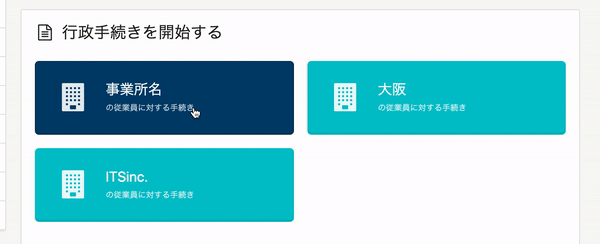
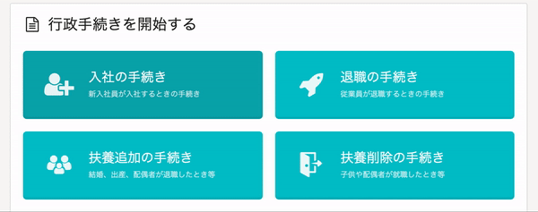
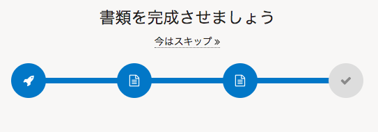

2021年2月25日（木）に行なったアップデートの詳細をお知らせします。

SmartHR基本機能の変更点は、カイゼン2件でした。

# 📈 カイゼン

## ダッシュボードの手続きボタンをクリックしたときの色を変更しました

ダッシュボードの手続きボタンを、Commandキーなどを押しながらクリックすると青系のカラーになっていたため、他のボタンと同じように緑系のカラーに変更しました。

| 変更前 | 変更後 |
| --- | --- |
|  |  |

## 手続きのステップ画面のUIを変更しました

これまでは、手続きのステップ画面上部にある進捗を表す青の範囲が多かったため、現在完了しているところまで青、それ以降はグレーにしました。

| 変更前 | 変更後 |
| --- | --- |
|  |  |
