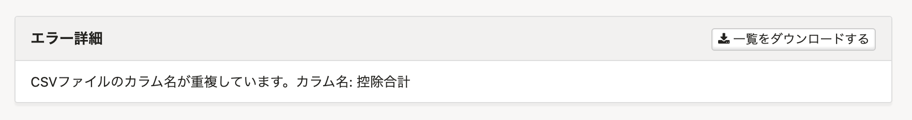
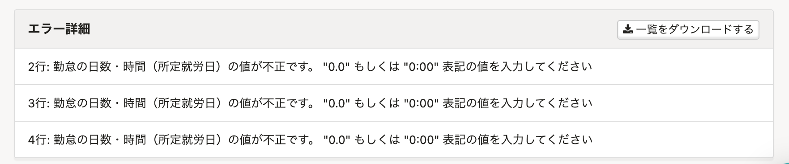

2021年3月1日（月）に行なったアップデートの詳細をお知らせします。

SmartHR基本機能の変更点は、カイゼン1件・アクセシビリティ1件・不具合修正1件でした。

# 📈 カイゼン

## 給与明細の取り込み速度をカイゼンしました

これまでは給与明細ファイルの取り込みに時間がかかることがありましたが、取り込み速度をカイゼンしました。

またこの改修にともない、以下2点の挙動もカイゼンしています。

- 取り込むCSVのカラムに重複があった場合

これまでは重複行の片方の値が反映されていましたが、**\[CSVファイルのカラム名が重複しています\]** とエラーメッセージを表示させるようにしました。

- 勤怠項目の値として、数値を入れるべき部分に文字列を入れた場合

これまでは予期しないエラー画面になっていましたが、**\[◯◯の値が不正です。** **"0.0"** **もしくは** **"0:00"** **表記の値を入力してください\]**とエラー詳細を表示させるようにしました。

# 🎢 アクセシビリティ

## Firefoxでダッシュボードの手続きボタンをドラッグ&ドロップしたときの色を変更しました

Firefoxでダッシュボードの手続きボタンをドラッグ&ドロップして別タブで画面表示させると、ボタンが青系のカラーになっていたため、他のボタンと同じように緑系のカラーに変更しました。

# 👨‍⚕️ 不具合修正

特定条件の従業員情報を追加する際のエラー動作に関する1件の不具合修正を行ないました。
