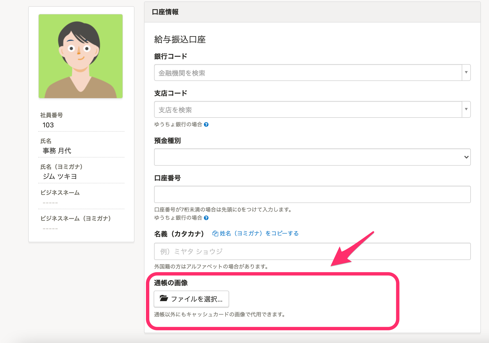
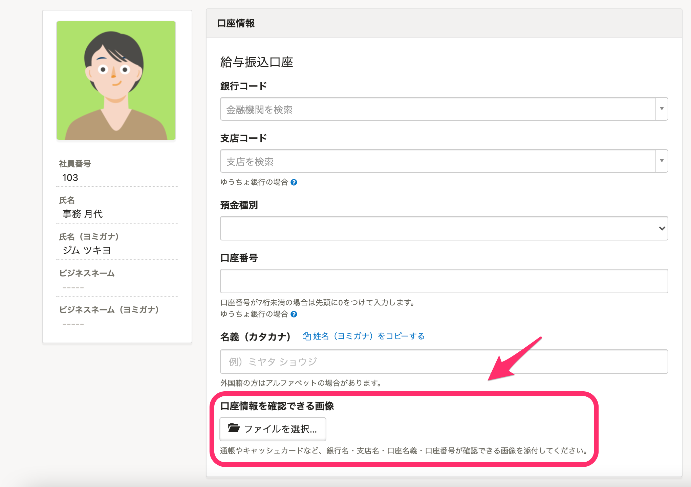
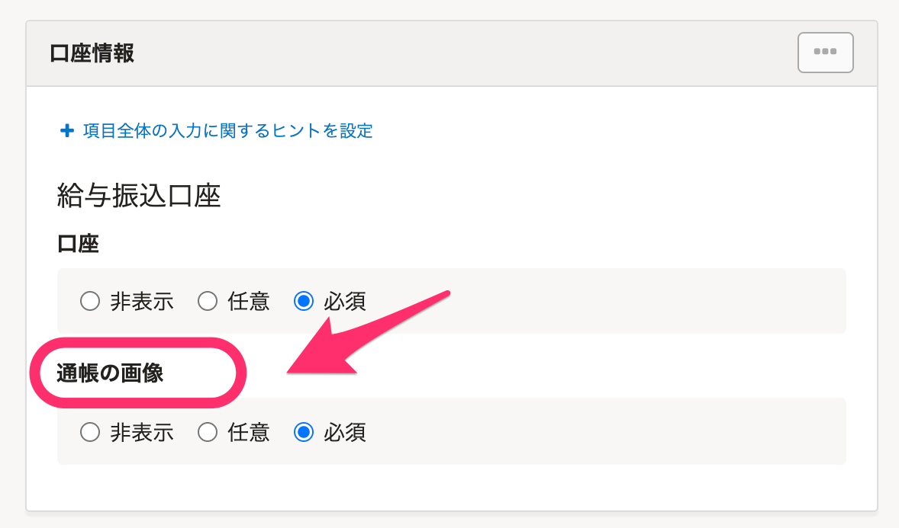
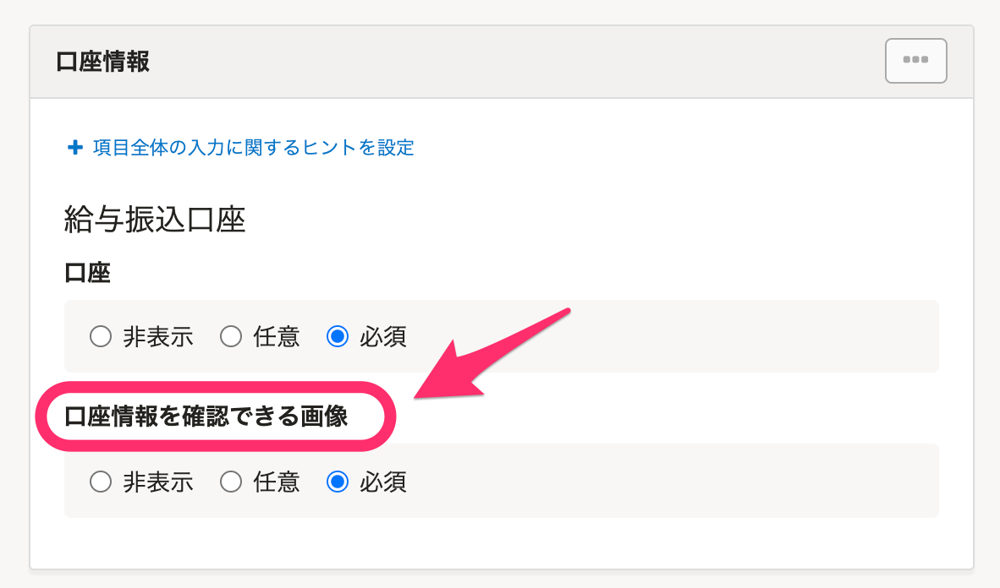
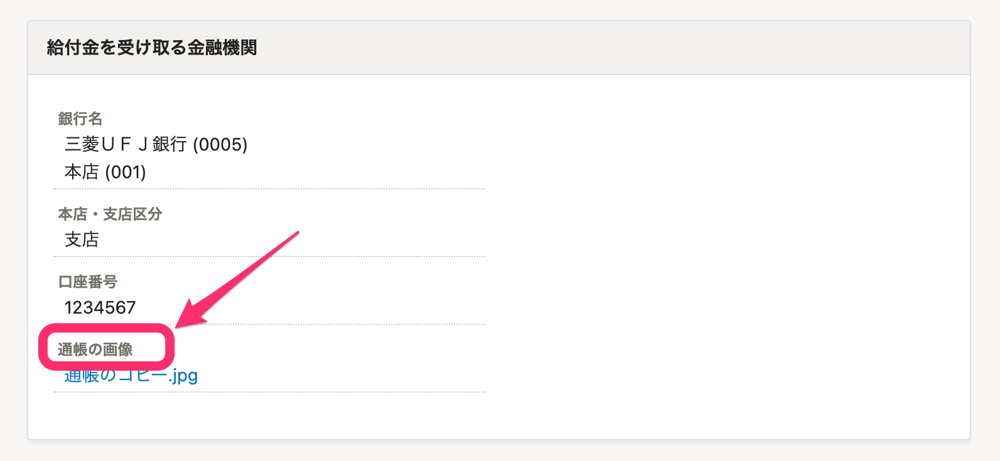
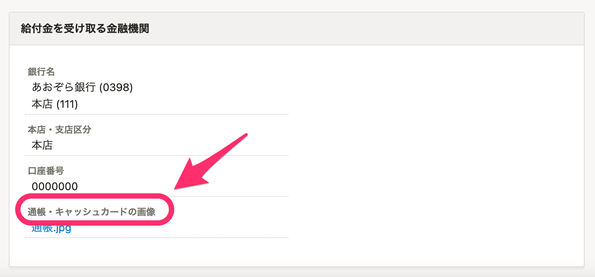
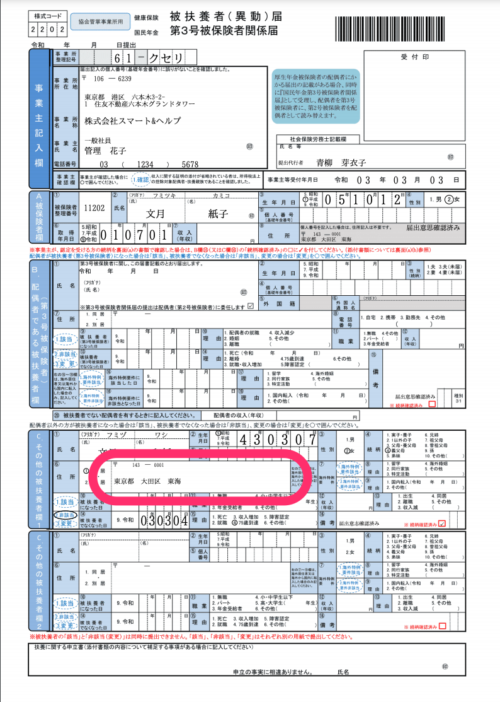
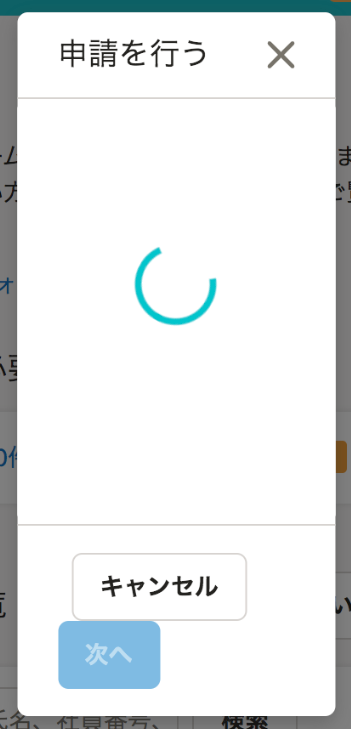
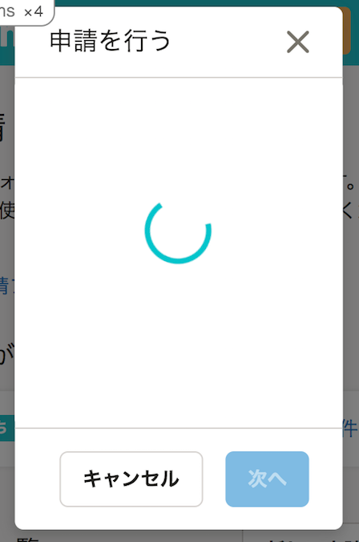

2021年3月2日（火）に行なったアップデートの詳細をお知らせします。

SmartHR基本機能の変更点は、カイゼン4件・不具合修正1件でした。

# 📈 カイゼン

## 従業員情報・申請／招待／育休情報フォーム配下の \[通帳の画像\] ラベルの文言を変更しました

紙の通帳が発行されない銀行口座に対応するため、従業員情報・申請／招待／育休情報フォームにある **\[通帳の画像\]** という文言を下記のとおり変更しました。

- **従業員口座情報**

| 変更前 |  |
| --- | --- |
| 変更後 |  |

- **申請フォーム**

| 変更前 |  |
| --- | --- |
| 変更後 |  |

- **育児休業給付金申請の手続きフォーム**

| 変更前 |  |
| --- | --- |
| 変更後 |  |

## 「健康保険被扶養者（異動）・国民年金第３号被保険者関係届」（２０２０年１２月以降手続き）の新様式に対応しました

健康保険法の一部改正（海外特例要件の追加）にともない、「健康保険被扶養者（異動）・国民年金第３号被保険者関係届」の様式に「その他被扶養者の住所欄」が追加になったため、手続き書類を新様式に対応させました。

今回はPDFのみの対応となり、今後e-Gov対応も予定しています。

**健康保険被扶養者（異動）・国民年金第３号被保険者関係届**

## 一括登録・更新のサンプルファイルのダウンロード速度をカイゼンしました

下記の内部動作を最適化し、速度をカイゼンしました。

- 従業員情報を一括登録・更新するサンプルファイルのダウンロード
- 従業員情報ダウンロードの際の一部処理

## スマートフォン画面で申請ダイアログのボタンが改行されないようにしました

これまでスマートフォン画面で申請ダイアログを開くと、**\[キャンセル\]** と **\[次へ\]** ボタンが改行して表示されていましたが、今回の改修でボタンが改行されないようにしました。

| 変更前 | 変更後 |
| --- | --- |
|  |  |

# 👨‍⚕️ 不具合修正

従業員リストをダウンロードした際のExcel表示に関する1件の不具合修正を行ないました。
