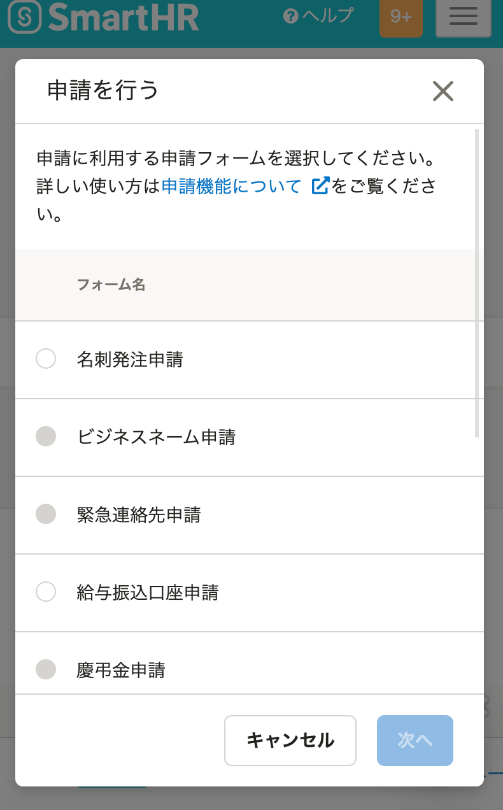

2021年3月3日（水）に行なったアップデートの詳細をお知らせします。

SmartHR基本機能の変更点は、アクセシビリティ1件・不具合修正1件でした。

# 🎢 アクセシビリティ

## 申請ダイアログの表示幅を端末ごとに調整しました

これまでは端末の画面サイズによって申請ダイアログの表示崩れが起きてしまっていました。

そのため今回の改修で、申請ダイアログの表示幅をPC、タブレット、スマートフォンでそれぞれサイズが定まるように調整しました。

またスマートフォンの場合にはフォーム名の途切れ方に違和感があったため、適切な表示になるよう調整しました。

- **PC画面**

- **タブレット画面**

- **スマートフォン画面**

# 👨‍⚕️ 不具合修正

特定条件で扶養追加手続きを行なった際のマイナンバー関連のエラーに関する1件の不具合修正を行ないました。
