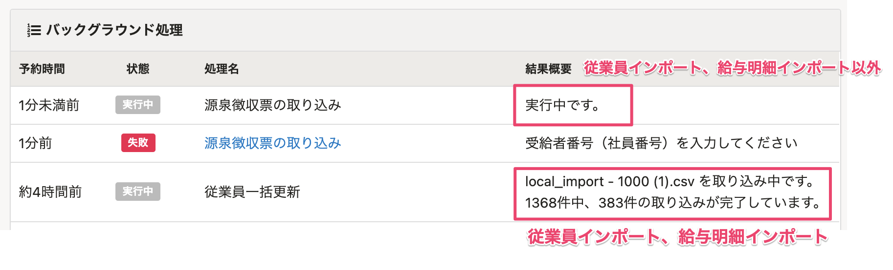

2021年3月8日（月）に行なったアップデートの詳細をお知らせします。

SmartHR基本機能の変更点は、カイゼン1件でした。

# 📈 カイゼン

## 一部のバックグラウンド処理の進捗状況がわかるようにしました

「従業員情報の取り込み」と「給与明細の取り込み」の進捗状況を、バックグラウンド処理の **\[結果概要\]** 欄で確認できるようにしました。

今回の改修で取り込みの進捗状況を可視化させることで、長時間のバックグラウンド処理中に管理者の方の業務のスケジュールを立てやすくすると同時に、正常に処理が進行していることの確認もできるようにしました。

