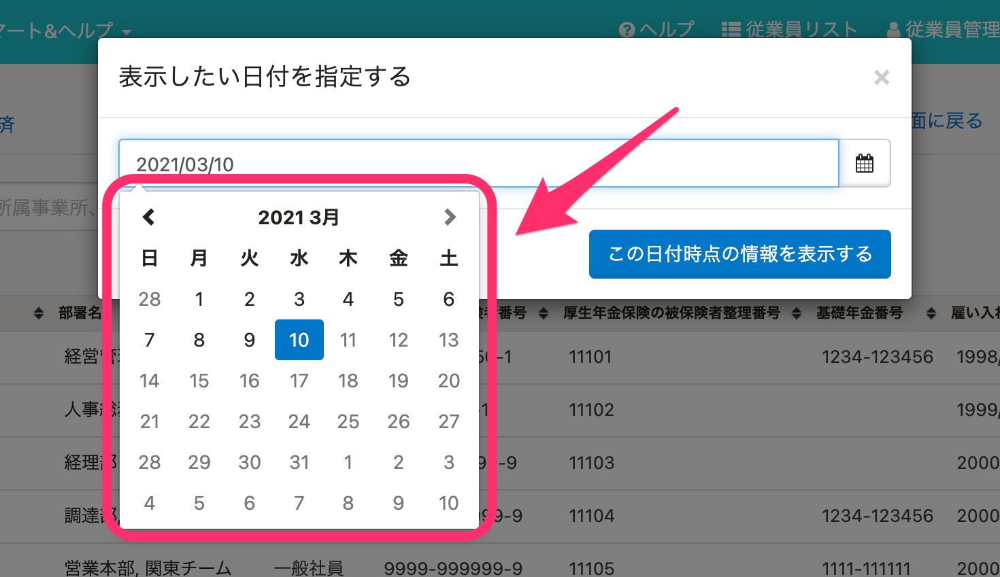

2021年3月9日（火）に行なったアップデートの詳細をお知らせします。

SmartHR基本機能の変更点は、新機能1件・不具合修正1件でした。

# ✨ 新機能

## 旧従業員リストの日付指定で未来の日付を選択できないようにしました

これまでは旧従業員リストの日付指定検索は、未来の日付も選択ができていましたが、今回の改修で操作日より未来の日付をグレーアウトにし、選択できないようにしました。

| 変更前 |  |
| --- | --- |
| 変更後 |  |

:::related
[日付を指定して履歴を閲覧する方法｜従業員情報の変更履歴を閲覧する](https://knowledge.smarthr.jp/hc/ja/articles/360026262633)
:::

# 👨‍⚕️ 不具合修正

雇用保険の資格取得日が、昭和以前である従業員の「雇用保険被保険者資格取得届」を作成した際の挙動に関する1件の不具合修正を行ないました。
