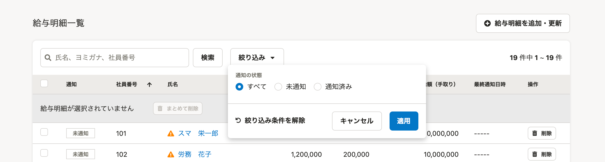
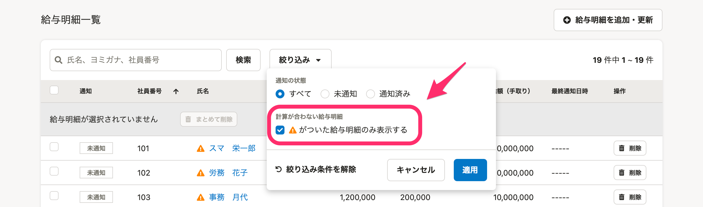

2021年3月10日（水）に行なったアップデートの詳細をお知らせします。

SmartHR基本機能の変更点は、カイゼン1件・不具合修正1件でした。

# 📈 カイゼン

## 給与明細一覧で［！］アイコンが表示されている明細を絞り込めるようにしました

これまで給与明細一覧が「未確定」の場合、［！］アイコンが出ている明細を探すには、ページ送りをしながら探すという手間がありました。

そこで今回の改修で、［！］アイコンのついた明細だけを絞り込めるようにし、簡単に探せるようにしました。

| 変更前 |  |
| --- | --- |
| 変更後 |  |

# 👨‍⚕️ 不具合修正

従業員情報の必須項目を入力した時点の履歴を削除しようとした際の挙動に関する1件の不具合修正を行ないました。
