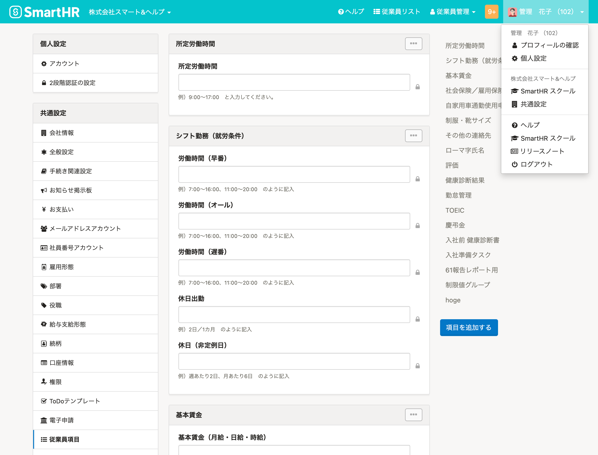
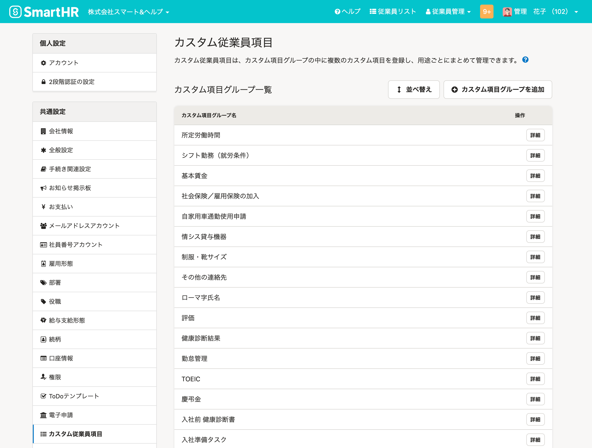

2021年3月11日（木）に行なったアップデートの詳細をお知らせします。

SmartHR基本機能の変更点は、新機能1件・不具合修正1件でした。

# ✨ 新機能

## ［従業員項目］を［カスタム従業員項目］に変更し、デザインもリニューアルしました

 **［従業員項目］** の画面デザインをリニューアルし、名称を **［カスタム従業員項目］** に変更しました。

また、これまでの画面はすべてのカスタム従業員項目をまとめて表示していたため、登録項目数が多い場合は表示速度が遅くなってしまっていました。

そのため今回のリニューアルで、 **［カスタム項目グループ一覧］** と、グループ内の **［カスタム項目一覧］** の画面を分割し、表示や内部動作の速度をカイゼンしました。

:::related
[\[3/11更新\]カスタム従業員項目の管理画面のデザインをリニューアルしました](https://smarthr.jp/update/22784)
:::

| 変更前 |  |
| --- | --- |
| 変更後 |  |

カスタム従業員項目の追加・編集方法は下記のページをご覧ください。

:::related
[カスタム従業員項目を追加する](https://knowledge.smarthr.jp/hc/ja/articles/360026265513)
:::

# 👨‍⚕️ 不具合修正

 **［入社手続き］** \> **［本人に基本情報を入力してもらう］** を選択した際の従業員表示に関する1件の不具合修正を行ないました。
