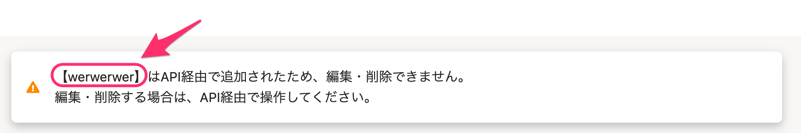

2021年3月12日（金）に行なったアップデートの詳細をお知らせします。

SmartHR基本機能の変更点は、カイゼン1件・不具合修正2件でした。

# 📈 カイゼン

## 項目が編集・更新できないことを伝えるパネル内の項目名称に【】をつけました

APIで作成したカスタム項目やカスタム項目グループが、SmartHRのUI上からは編集・削除できないタイプに設定されている際に、画面上部に表示されるパネル内の項目名に、【】（隅付きカッコ）をつけるようにしました。

SmartHR全体での表記ルールに合わせた対応です。

# 👨‍⚕️ 不具合修正

「健康保険被扶養者（異動）届・国民年金第3号被保険者関係届」で表示する住所に関する修正など、2件の不具合修正を行ないました。
