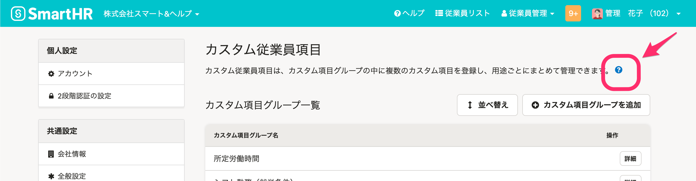
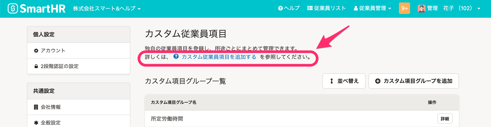
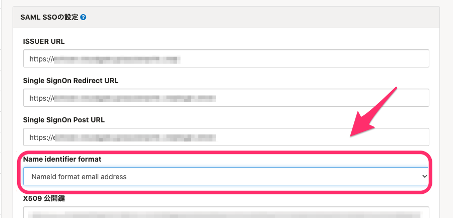
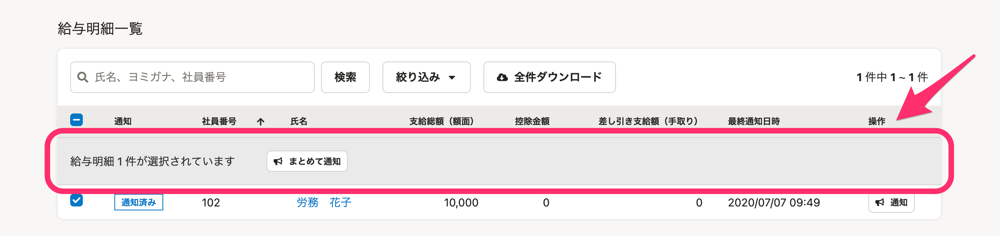
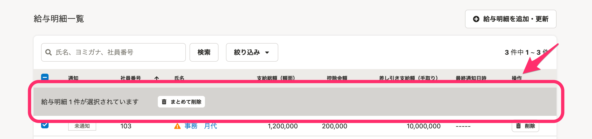
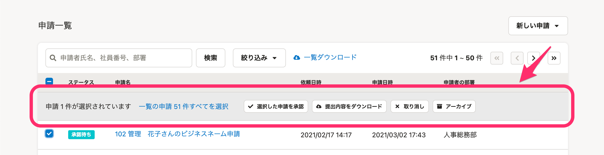
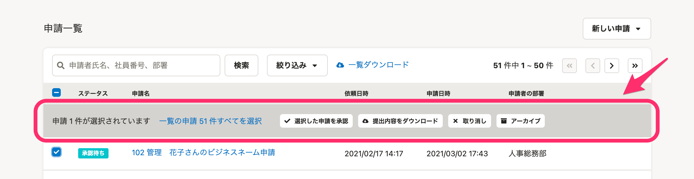

2021年3月16日（火）に行なったアップデートの詳細をお知らせします。

SmartHR基本機能の変更点は、カイゼン2件・アクセシビリティ2件・不具合修正1件でした。

# 📈 カイゼン

## カスタム従業員項目のヘルプページへのリンクをわかりやすくしました

これまでカスタム従業員項目のタイトル下にあるヘルプページへのリンクは **［？］** のみで、わかりづらいものでした。

そのため今回の改修で **［詳しくは、カスタム従業員項目を追加する を参照してください。］** とヘルプページのタイトルを明記して、わかりやすくしました。

| 変更前 |  |
| --- | --- |
| 変更後 |  |

## SAML/SSO の設定で［Name\_identifier\_format ］を指定できるようにしました

すこし専門的な話になってしまいますが、外部連携 SAML/SSOの設定で **［Name identifier format］** を指定できるようにしました。

選択肢は基本的に、デフォルトの  **［Nameid format email address］** で問題ありません。

:::related
[SAML認証（SSO）を設定する](https://knowledge.smarthr.jp/hc/ja/articles/360037010093)
:::

# 🎢 アクセシビリティ

## テキストカラーを新たに変更しました

視認性向上の取り組みの一環でSmartHR全体のカラーを差し替えましたが、グレーテキスト・リンクテキストが一部の背景色に対して、十分なコントラスト比が確保されていませんでした。

そのため今回の改修で、それぞれコントラスト比を確保した色へ新たに置き換えました。

:::related
[SmartHRの画面のカラーが新しくなりました](https://smarthr.jp/update/21763)
:::

## 給与明細や申請画面で、まとめて従業員を選択操作できる箇所の背景色を変更しました

給与明細一覧や申請一覧画面で、選択した従業員に対してまとめて操作できる箇所の背景色を変更しました。

**給与明細一覧**

| 変更前 |  |
| --- | --- |
| 変更後 |  |

**申請一覧**

| 変更前 |  |
| --- | --- |
| 変更後 |  |

# 👨‍⚕️ 不具合修正

従業員の家族情報の **［送金額（単位：円）］** の入力可能値に関する1件の不具合修正を行ないました。
