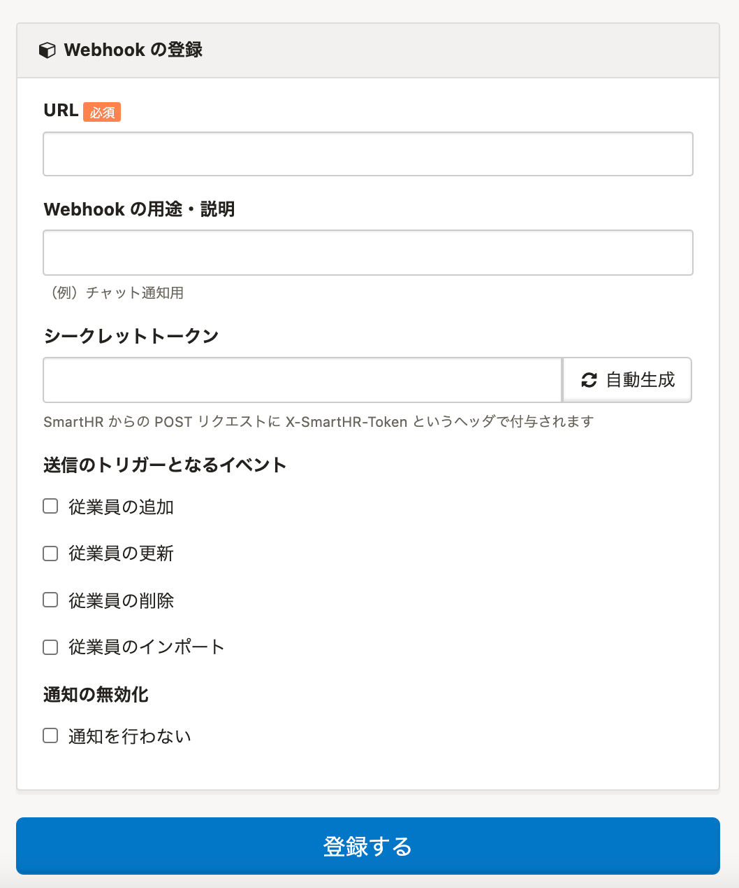

2021年3月17日（水）に行なったアップデートの詳細をお知らせします。

SmartHR基本機能の変更点は、新機能1件・カイゼン3件・不具合修正1件でした。

# ✨ 新機能

## Webhookで家族情報をトリガーにできるようにしました

これまではWebhook送信のトリガーとなる情報は従業員情報のみでしたが、家族情報もトリガーにできるようにしました。

家族情報の追加・更新・削除・インポートがあった際に、Webhookを利用して通知の設定が可能です。

| 変更前 | 変更後 |
| --- | --- |
|  |  |

# 📈 カイゼン

## 別タブで開くリンクの挙動を変更しました

クリックした際に別タブで開くリンクの挙動を、セキュリティの観点で一部変更しました。

## パネルのテキストカラーを黒にし、視認性を向上させました

これまでのパネルのテキストカラーは枠の色と同じで視認性が低かったため、すべてのパネルのテキストカラーを黒にし、視認性を向上させました。

| 変更前 | 変更後 |
| --- | --- |
|  |  |
|  |  |
|  |  |
|  |  |

## 経路詳細画面のインフォメーションパネルの文言に句点をつけました

SmartHR全体での表記ルールに合わせるため、 **［**  **共通設定］>［経路詳細］** の画面上部にあるインフォメーションパネルの文末に句点をつけました。

| 変更前 | 変更後 |
| --- | --- |
|  |  |

# 👨‍⚕️ 不具合修正

Excel形式の拡張子表記に関する1件の不具合修正を行ないました。
