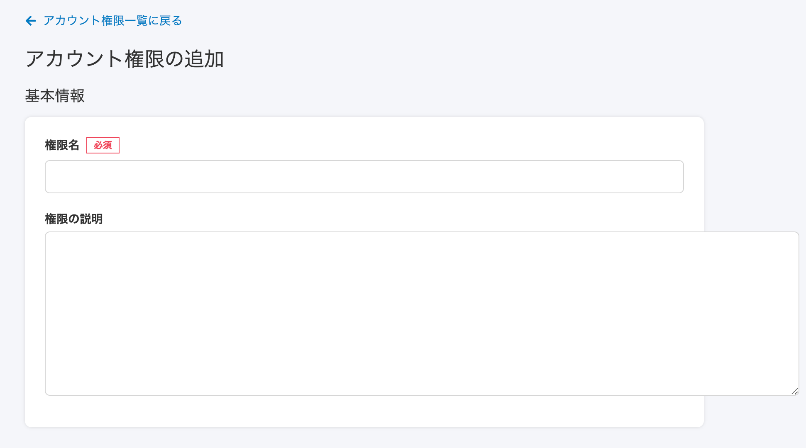
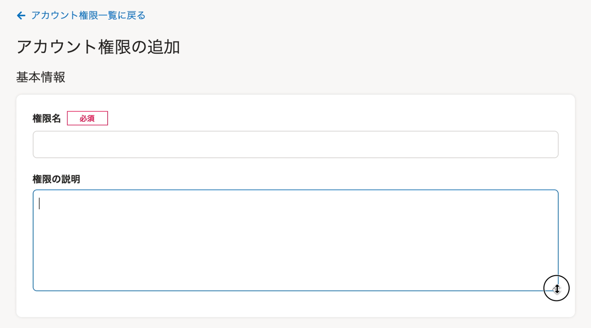
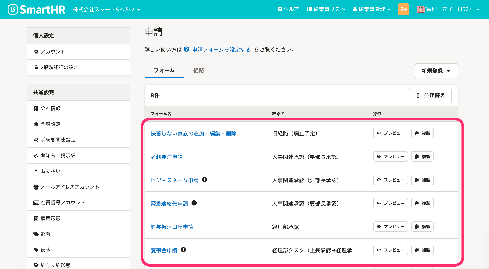
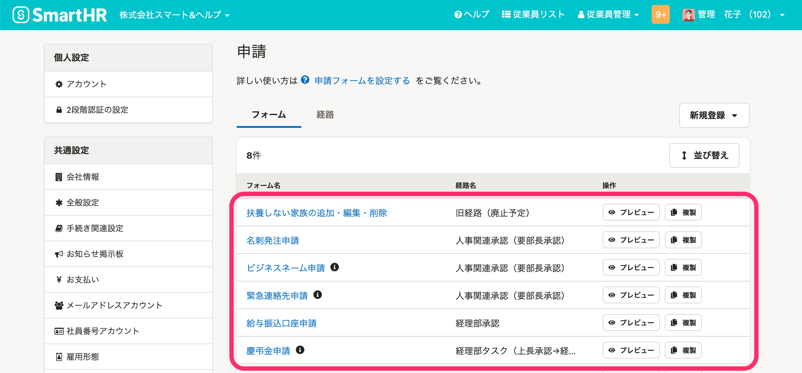

2021年3月19日（金）に行なったアップデートの詳細をお知らせします。

SmartHR基本機能の変更点は、カイゼン2件でした。

# 📈 カイゼン

## テキスト入力欄を縦方向のみサイズ変更できるようにしました

これまでは、テキストを複数行入力できる箇所のサイズを横に広げた際に、枠からはみ出るまで広げられました。

そのため今回の改修で、縦方向のみサイズ変更できるようにし、枠からはみ出さないようにしました。

| 変更前 |  |
| --- | --- |
| 変更後 |  |

## 申請・経路フォーム一覧の行の高さを低くしました

 **［共通設定］**  \>  **［申請］** のフォーム一覧と経路一覧の表の行の高さを、SmartHR UIのルールに合わせた高さに変更しました。

| 変更前 |  |
| --- | --- |
| 変更後 |  |
