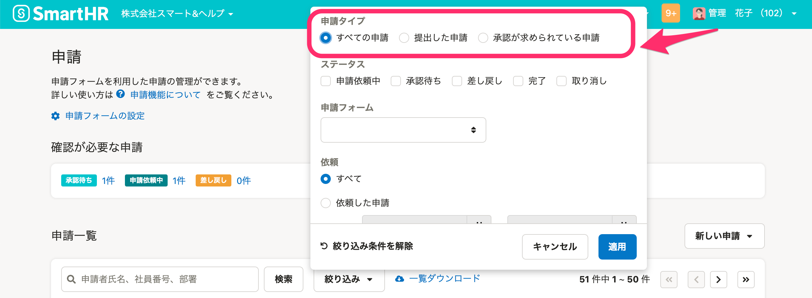
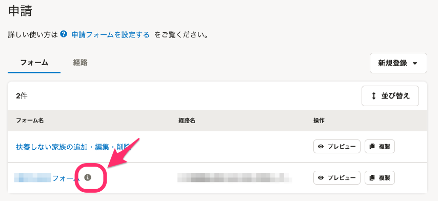
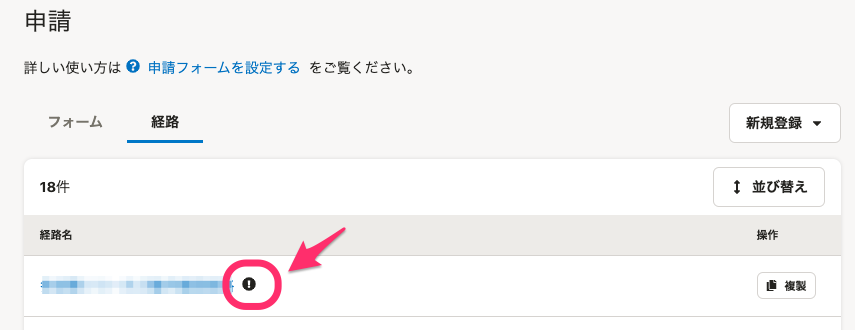
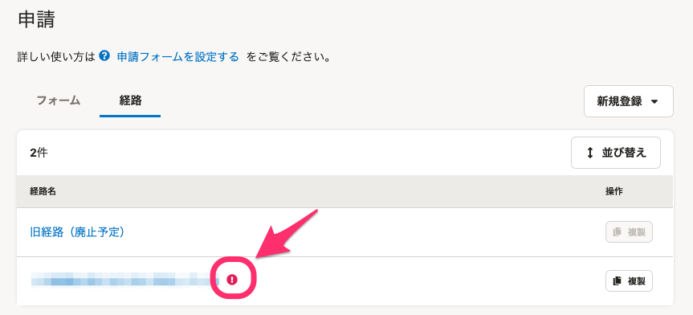
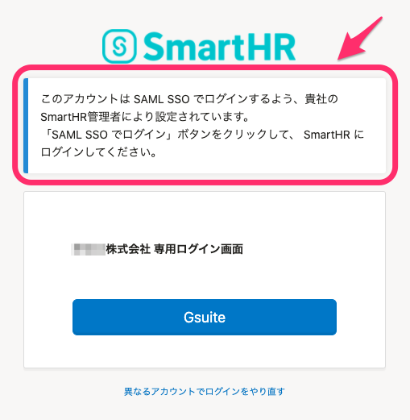
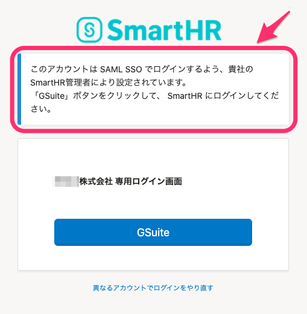

2021年3月23日（火）に行なったアップデートの詳細をお知らせします。

SmartHR基本機能の変更点は、カイゼン4件・不具合修正1件でした。

# 📈 カイゼン

## 従業員に紐付かないアカウントでも、申請機能の［絞り込み］フィルターに［申請タイプ］を表示するようにしました

これまでは従業員に紐づいたアカウントのみ、申請機能の **［絞り込み］** フィルターに **［申請タイプ］** の項目が表示されていました。

しかし承認ステップが複数設けられた申請では、従業員と紐づいていなくても承認できるパターンがあるため、権限や従業員の状態によらず **［申請タイプ］** で検索表示できるようにしました。

## 申請・権限一覧のアイコンカラーを変更しました

 **［申請］［権限］** 一覧に表示される  **［i］** （インフォーメションアイコン）と、 **［!］** （アラートアイコン）のカラーがすべて黒になってしまっていたため、 **［i］** はグレー、 **［!］** は赤にし、アイコン同士の区別をつけやすくしました。

**i アイコン**

| 変更前 | 変更後 |
| --- | --- |
|  |  |

**！アイコン**

| 変更前 | 変更後 |
| --- | --- |
|  |  |

## SAML SSOログインボタンのラベルをパネルに反映させました

SAML SSOが有効なアカウントがメールアドレスとパスワードでログインをした際にSAMLでのログインを促す画面で、ユーザー独自に設定できるログインボタンのラベルがパネル内のメッセージに反映されていませんでした。

そのため、パネル内のメッセージを独自のラベルを反映するよう変更しました。

| 変更前 | 変更後 |
| --- | --- |
|  |  |

## 申請依頼時のエラー文言を変更しました

申請依頼でエラーが発生した際の文言にフォーム名と経路名を含めるようにし、対応が必要な箇所をわかりやすくしました。

# 👨‍⚕️ 不具合修正

申請の **［絞り込み］** ダイアログ内の挙動に関する1件の不具合修正を行ないました。
