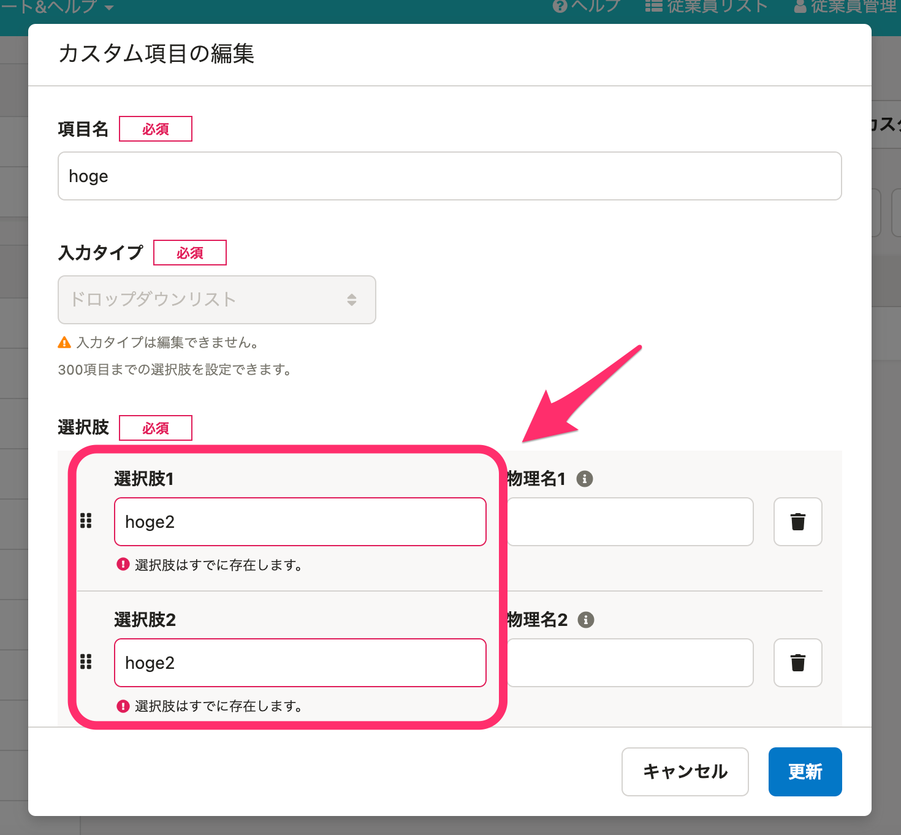
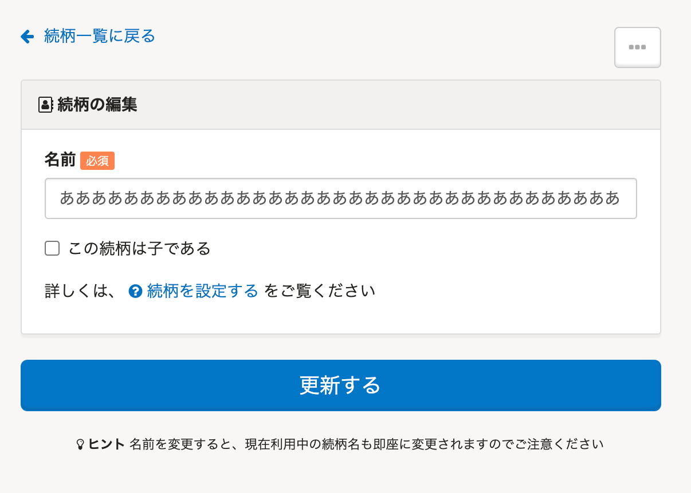

2021年3月24日（水）に行なったアップデートの詳細をお知らせします。

SmartHR基本機能の変更点は、カイゼン2件・不具合修正2件でした。

# 📈 カイゼン

## カスタム項目の選択肢にエラーがある場合は入力欄が赤くなるようにしました

カスタム項目を登録・更新する際、ドロップダウンリストの選択肢に入力エラーがあった場合、各入力欄の枠を赤くハイライトするようにしました。

## 続柄の登録可能上限文字数を100文字にしました

続柄の **［名前］** 登録可能上限数を100文字に設定しました。

101文字目以降は削除され、入力できません。

# 👨‍⚕️ 不具合修正

チャットボットに関する修正など、2件の不具合修正を行ないました。
