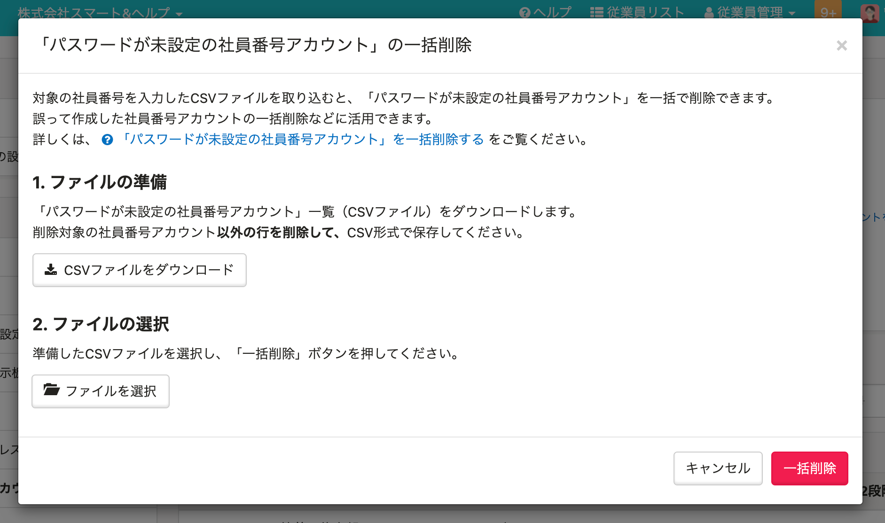

2021年3月25日（木）に行なったアップデートの詳細をお知らせします。

SmartHR基本機能の変更点は、新機能1件でした。

# ✨ 新機能

## パスワードを設定していない社員番号アカウントを一括で削除できるようにしました

これまでは、誤って複数の社員番号アカウントを作成してしまった場合に、1件ずつアカウントを削除して登録し直す必要がありました。

そこで今回のリリースで、パスワードの初回設定をしていない未承認の社員番号アカウントを一括で削除できるようにしました。

:::related
[未承諾の社員番号アカウントを一括削除できるようになりました](https://smarthr.jp/update/23838)
:::

管理者が設定した初期パスワードでログインした後に、従業員が新しいパスワードを設定していない社員番号アカウントが対象です。

従業員がパスワードを設定した社員番号アカウントは一括削除できません。

詳しい操作方法は、下記のヘルプページをご覧ください。

:::related
[「パスワードが未設定の社員番号アカウント」を一括削除する](https://knowledge.smarthr.jp/hc/ja/articles/900006181403)
:::

