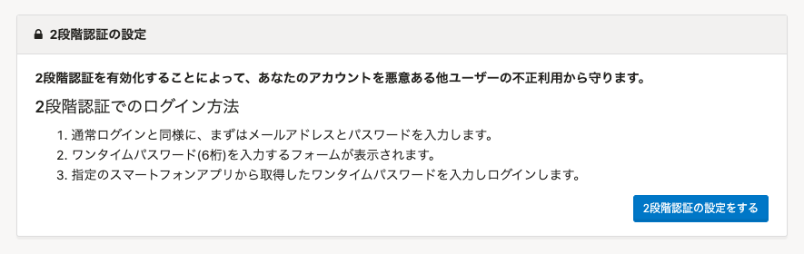
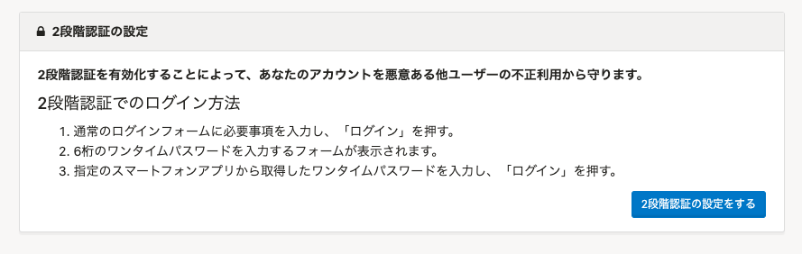

2021年3月26日（金）に行なったアップデートの詳細をお知らせします。

SmartHR基本機能の変更点は、カイゼン1件・不具合修正3件でした。

# 📈 カイゼン

## ［2段階認証の設定］画面の説明文を変更しました

 **［2段階認証の設定］** の説明が、アカウントの種類によっては実際の操作と一致しない内容だったため、下図のとおり変更しました。

| 変更前 |  |
| --- | --- |
| 変更後 |  |

# 👨‍⚕️ 不具合修正

従業員リストで検索した際にタイムアウトした場合の挙動に関する修正など、3件の不具合修正を行ないました。
