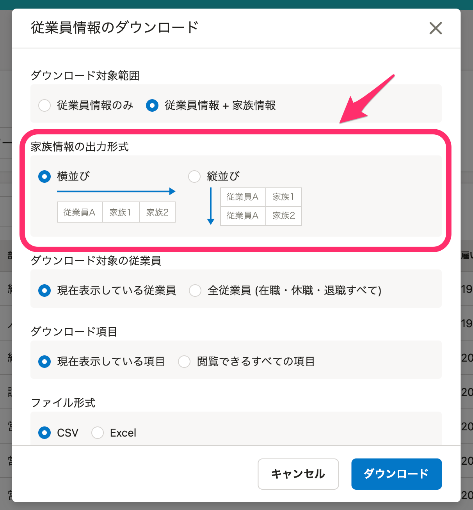
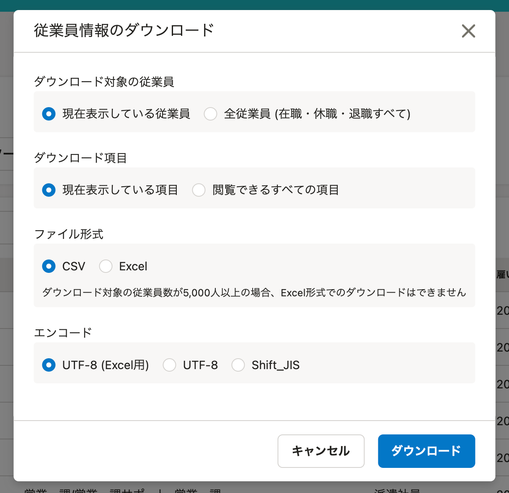
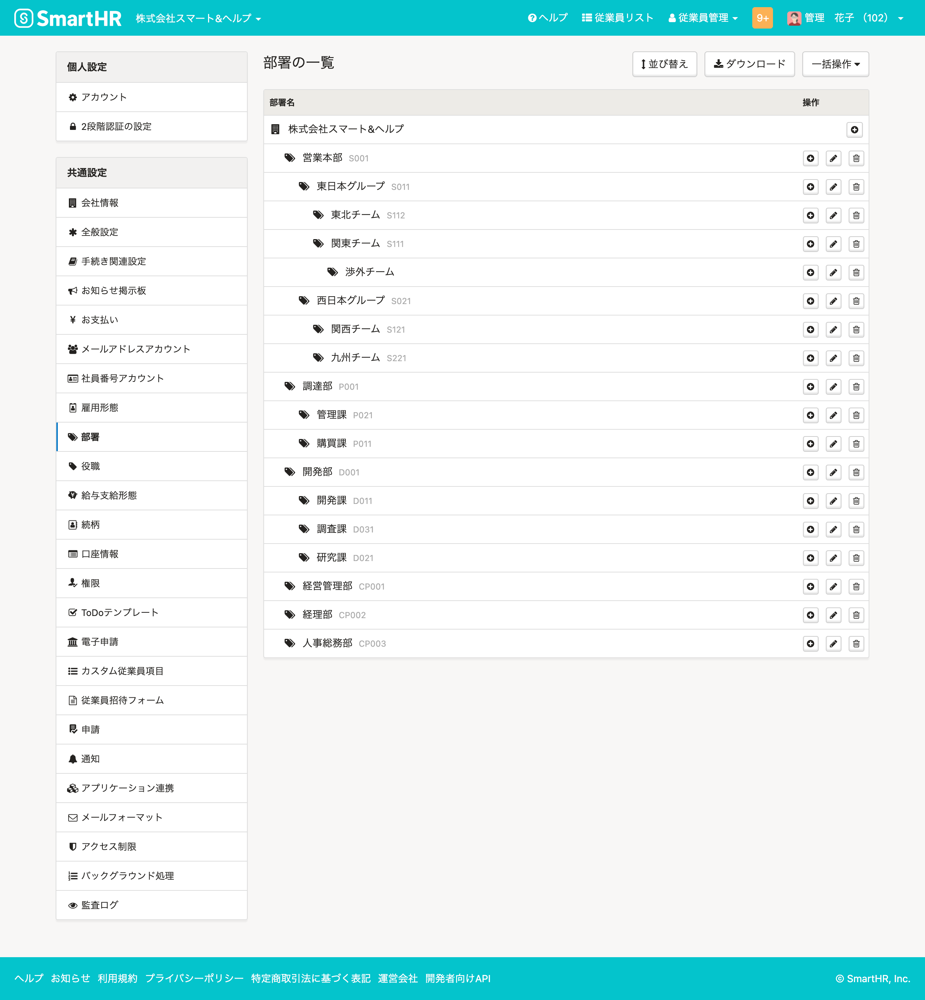
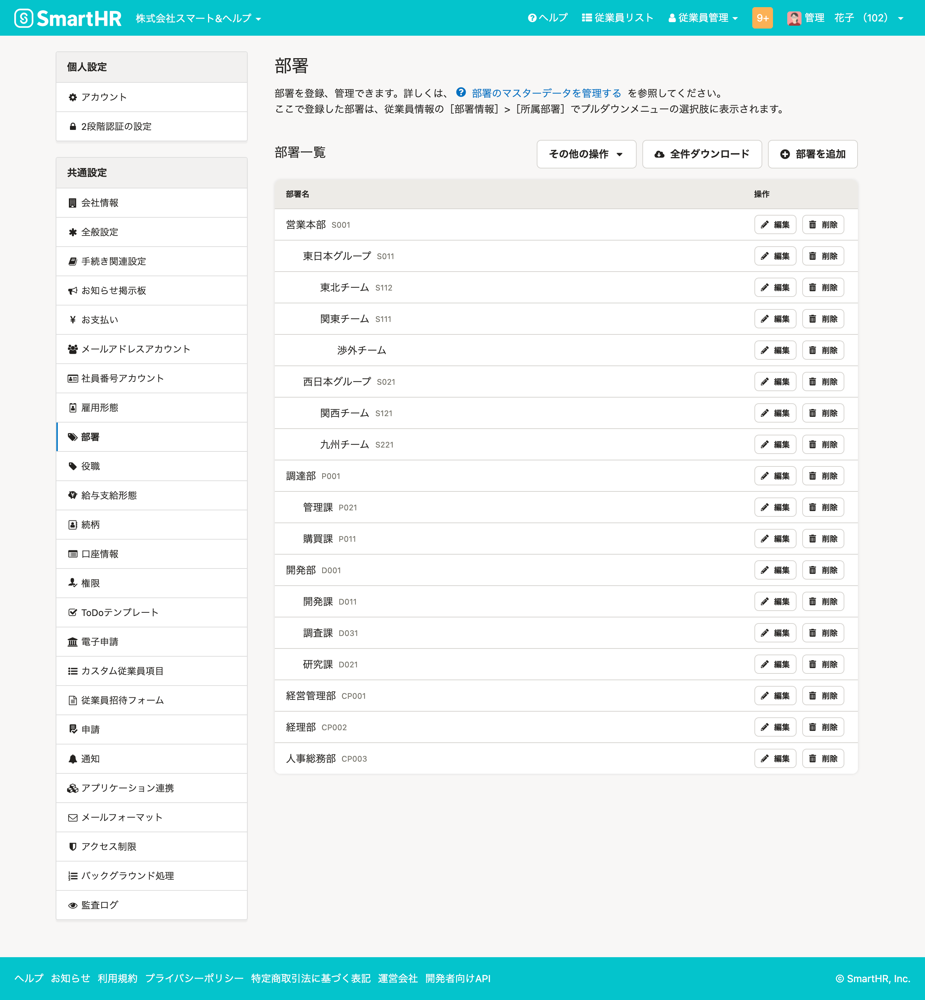
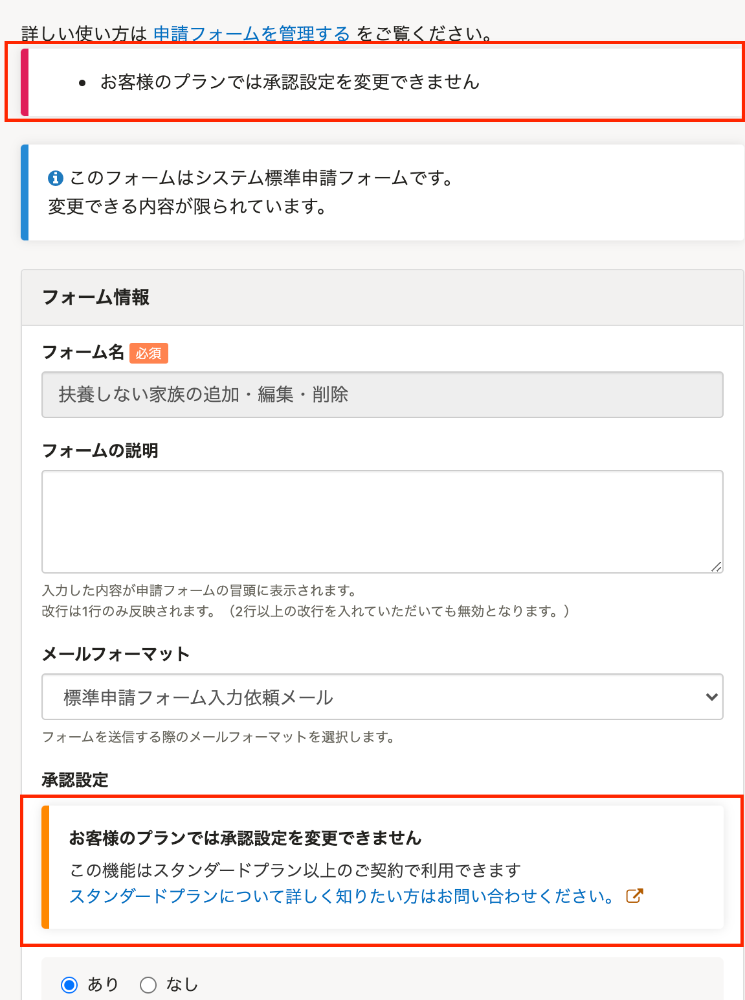
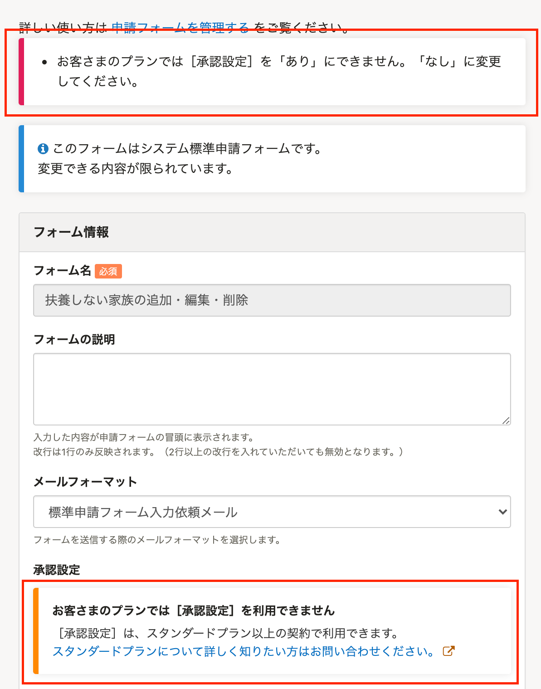

2021年3月30日（火）に行なったアップデートの詳細をお知らせします。

SmartHR基本機能の変更点は、新機能1件・カイゼン3件・不具合修正1件でした。

# ✨ 新機能

## 家族情報を［縦並び］でも出力できるようにしました

これまでは、従業員リストから家族情報をダウンロードする際の出力形式は **［横並び］** のみでした。

今回のリリースで、スタンダードプランもしくはプロフェッショナルプランをお使いの場合、 **［従業員情報のダウンロード］** 画面に **［家族情報の出力形式］** の項目を追加し、 **［横並び］**  **［縦並び］** を選択できるようにしました。

:::related
[家族情報を「縦並び」形式でもダウンロードできるようになりました](https://smarthr.jp/update/23973)
[家族情報の出力形式（横並び・縦並び）とは](https://knowledge.smarthr.jp/hc/ja/articles/900006277623)
:::

家族情報の閲覧権限がない従業員は、 **［家族情報の出力形式］** の項目は表示されません。

# 📈 カイゼン

## 部署マスターの管理画面を新しくしました

大量の部署がある場合でも操作を部署マスター画面の操作をしやすくするため、部署マスター管理画面を新しくしました。

既存機能である **［部署を並べ替え］［部署を一括追加］［部署を一括更新］** は **［その他の操作］** に含まれています。

今後、多くの部署を登録している際により便利にお使いいただけるよう、部署の階層を開閉できる機能や部署の絞り込み機能を順次提供していきます。

詳しい操作方法は下記のヘルプページをご覧ください。

:::related
[部署のマスターデータを管理する](https://knowledge.smarthr.jp/hc/ja/articles/360036111074)
:::

| 変更前 | 変更後 |
| --- | --- |
|  |  |

## ［行政手続き一覧］の表示速度をカイゼンしました

 **［行政手続き一覧］** が大量にあり、操作しているアカウントの権限が管理者以外の場合、 **［行政手続き一覧］** とトップページの表示が遅くなることがあったため、処理を最適化して表示速度をカイゼンしました。

## 申請フォーム画面のメッセージを変更しました

下記の2つの条件を満たしたときに表示される申請フォームのエラーメッセージを変更しました。

-  **［扶養しない家族の追加・編集・削除］** の申請フォーム で **［承認設定］** が「あり」の状態
-   料金プランをダウングレードし、申請フォームを更新する

また、同条件で **［承認設定］** 欄に表示されるパネルの文言も合わせて変更しました。

変更内容は下図のとおりです。

| 変更前 | 変更後 |
| --- | --- |
|  |  |

# 👨‍⚕️ 不具合修正

従業員カスタム項目を取り込んだ際のエラー表示に関する1件の不具合修正を行ないました。
