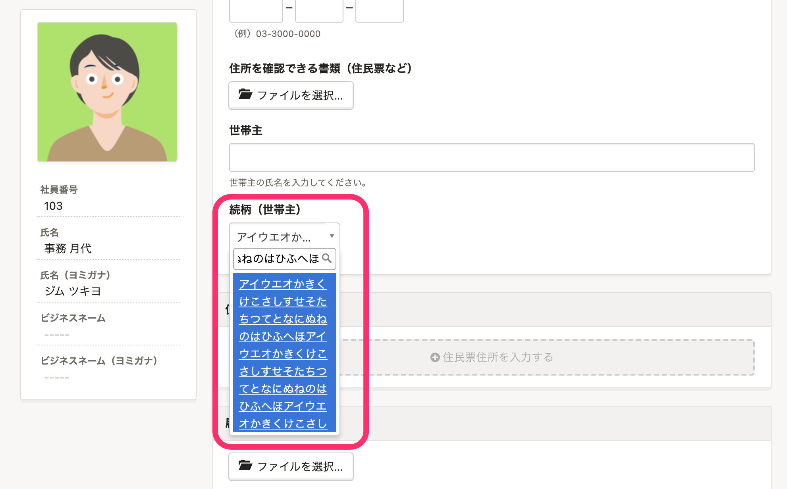

2021年3月31日（水）に行なったアップデートの詳細をお知らせします。

SmartHR基本機能の変更点は、カイゼン2件・不具合修正1件でした。

# 📈 カイゼン

## 従業員情報の［続柄（世帯主）］の入力可能上限文字数を100文字にしました

従業員情報の **［住所と連絡先］** にある **［続柄（世帯主）］** の項目の入力可能文字数を、10文字から100文字まで引き上げました。

## 源泉徴収票の取り込み速度をカイゼンしました

源泉徴収票のCSVファイルを取り込むのに時間がかかることがあったため、処理を見直し、速度をカイゼンしました。

# 👨‍⚕️ 不具合修正

モバイル端末のSafariで招待フォームにアクセスした際の挙動に関する1件の不具合修正を行ないました。
