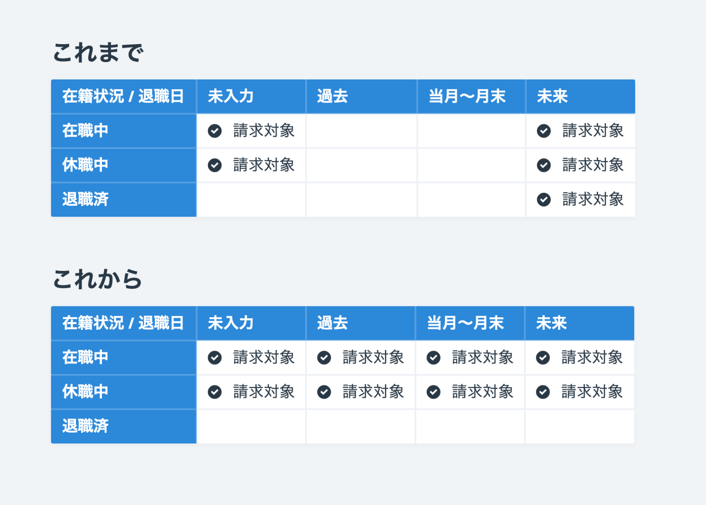

2021年4月1日（木）に行なったアップデートの詳細をお知らせします。

SmartHR基本機能の変更点は、新機能1件でした。

# ✨ 新機能

## 「請求の対象となる従業員の条件」と在籍状況の仕様を変更しました

請求の対象となる従業員の条件を変更し、それにともない従業員リストの表示条件、ステータスが退職済になるタイミングも変更しました。

変更内容は下記のとおりです。

### 1\. 請求の対象となる従業員の条件変更

これまでは「請求の対象となる従業員の条件」は、在籍状況と退職日の組み合わせで判定する複雑なルールでしたが、今回のリリースで、在籍状況のみで判定するわかりやすいものに変更しました。

:::related
[【再掲】「ご請求の対象となる従業員の条件」と在籍状況の仕様変更に関するお知らせ（4/1切替予定）](https://smarthr.jp/other/22960)
:::

これからは在籍状況が「在職中」か「休職中」の従業員のみが請求対象となります。

### 2\. 従業員リストの表示条件の変更

従業員リストの「在職中の従業員」「休職中の従業員」「退職済みの従業員」の表示条件も、新たな条件に合わせて在籍状況のみで判定するよう変更しました。

:::related
[Q. 従業員リストの「退職済みの従業員」に表示される条件は？](https://knowledge.smarthr.jp/hc/ja/articles/360026106294)
:::

### 3\. 在籍状況が退職済になるタイミングの変更

これまでは**退職手続きを作成した時点で**在籍状況が「退職済」に自動で変更される仕様でしたが、今回のリリースで、**退職日の翌日に**在籍状況が「退職済」に変更されるようにしました。

:::related
[退職の手続きを作成する](https://knowledge.smarthr.jp/hc/ja/articles/360026103514)
:::
