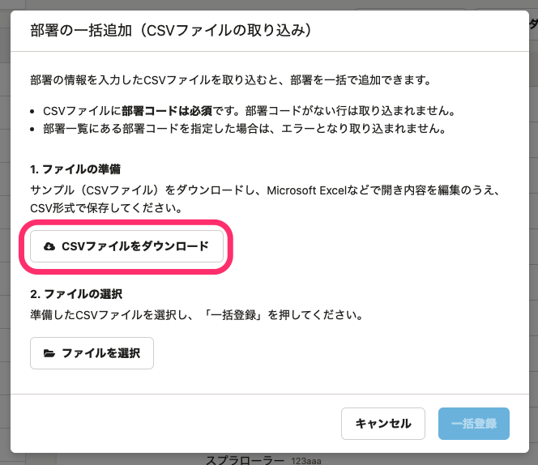
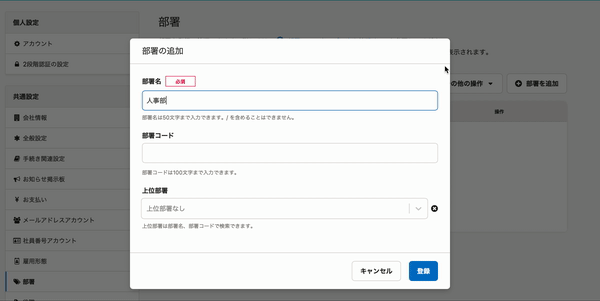

2021年4月5日（月）に行なったアップデートの詳細をお知らせします。

SmartHR基本機能の変更点は、カイゼン4件・不具合修正2件でした。

# 📈 カイゼン

## パスワード未設定の社員番号アカウントを一括削除する際のダイアログ内の文言を変更しました

パスワード未設定の社員番号アカウントを一括削除する際に表示されるダイアログ内にある **［ファイルの準備］** の説明文がわかりにくいものだったため、下図のとおり変更しました。

また、 **［ファイルの選択］** の説明文もSmartHR全体の表記ルールに合わせて変更しました。

| 変更前 | 変更後 |
| --- | --- |
|  |  |

## 部署を一括登録する際のダイアログ内の文言を変更しました

部署情報を一括追加する際のダイアログ内のボタン表記を、サンプルCSVがダウンロードされることが明確になるよう変更しました。

| 変更前 | 変更後 |
| --- | --- |
|  |  |

## 退職者権限の一括適用の対象となるアカウントの判定条件を変更しました

これまでは、退職者権限の一括適用の対象となるアカウントは、アカウントに紐付いた従業員の **［在籍状況］** と **［退職日］** の2つを組み合わせて判定していましたが、今回のリリースで、 **［在籍状況］** のみを判定の材料にしました。

 **［在籍状況］** が **［退職済］** の従業員に紐付いたアカウントが、一括適用の対象となっています。

先日のリリースでの、請求対象や従業員リストでの表示に合わせたものになります。

:::related
[2021/04/01 「請求の対象となる従業員の条件」と在籍状況の仕様を変更しました](https://knowledge.smarthr.jp/hc/ja/articles/900006408703)
:::

## 部署マスターで［部署を追加］［編集］［削除］の際の読み込みをテーブル内で行なうようにしました

これまでは部署マスターの画面で **［部署を追加］［編集］［削除］** を実行した際、画面全体を更新していましたが、部署一覧の表部分のみ更新するようにしました。

# 👨‍⚕️ 不具合修正

特定の条件で従業員リストのダウンロードをすると「原因の判定が行えなかったエラー」になる修正など、2件の不具合修正を行ないました。
