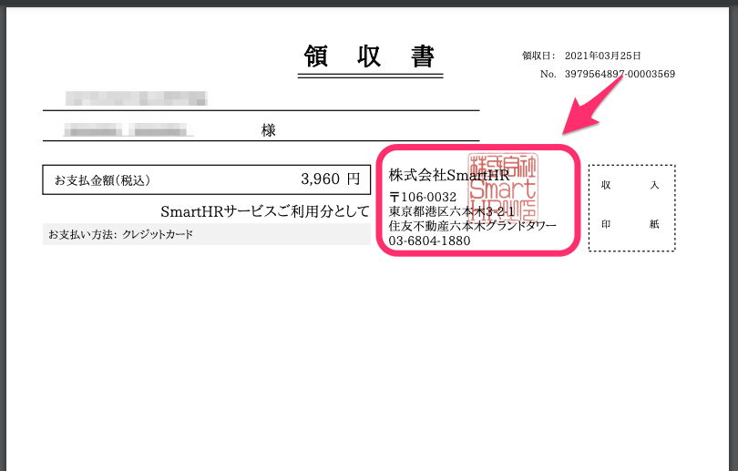

2021年4月6日（火）に行なったアップデートの詳細をお知らせします。

SmartHR基本機能の変更点は、カイゼン1件・不具合修正1件でした。

# 📈 カイゼン

## 領収書のSmartHRの住所を更新しました

 **［お支払い］** ページから発行する領収書のSmartHRの住所表記が古いものだったため、新しい住所に変更しました。

:::related
[領収書を確認する](https://knowledge.smarthr.jp/hc/ja/articles/360026106714)
:::

# 👨‍⚕️ 不具合修正

給与明細のダウンロードで氏名に記号が含まれている際の挙動に関する1件の不具合修正を行ないました。
