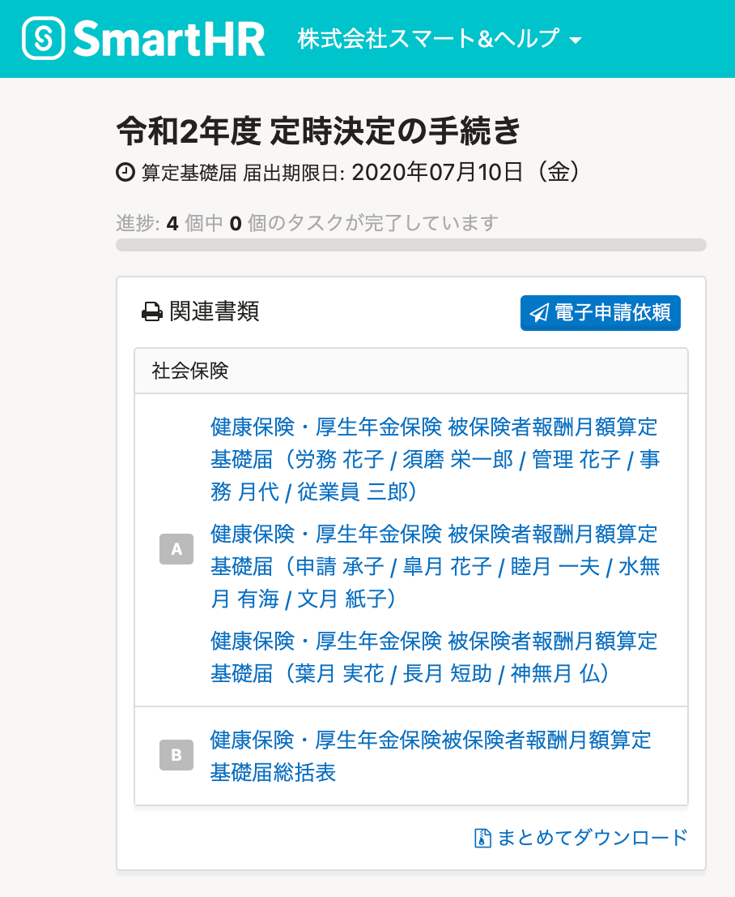
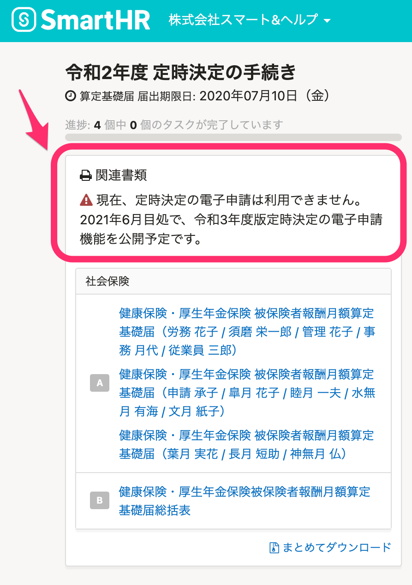
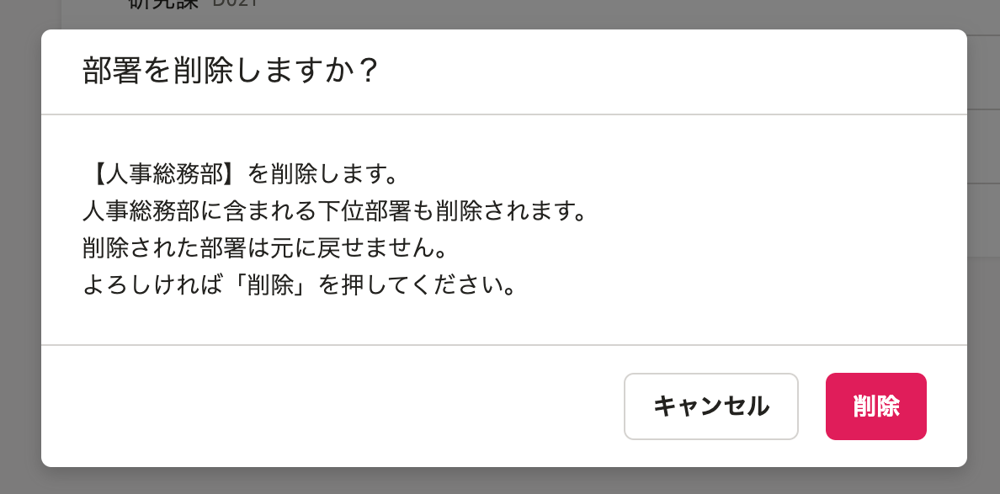
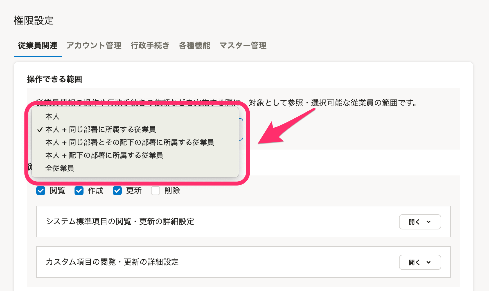
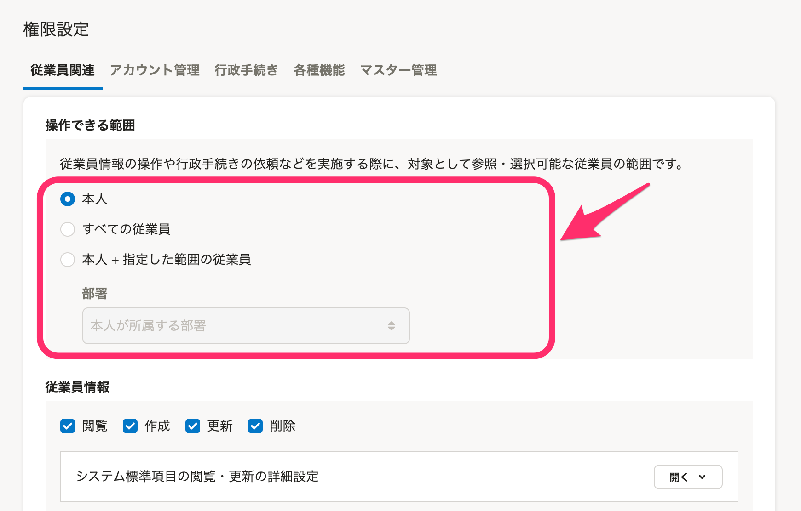

2021年4月7日（水）に行なったアップデートの詳細をお知らせします。

SmartHR基本機能の変更点は、カイゼン4件・不具合修正1件でした。

# 📈 カイゼン

## 従業員が多い企業アカウントで源泉徴収票のPDFを登録する際の挙動をカイゼンしました

登録している従業員が多い場合、これまでは、源泉徴収票のPDFを登録する **［PDFを従業員と紐付ける］** という画面が表示できずタイムアウトすることがありました。

今回の改修で内部動作を見直し、従業員が多い場合でも画面を正常に表示できるようにしました。

:::related
[源泉徴収票機能とは](https://knowledge.smarthr.jp/hc/ja/articles/360026106554)
:::

## 「労働保険年度更新」「定時決定」手続きの［電子申請依頼］ボタンを非表示にしました

現在「労働保険年度更新」「定時決定」の電子申請依頼はできないため、各手続き画面の **［電子申請依頼］** ボタンを非表示にし注釈を記載しました。

令和3年度版の電子申請機能は2021年6月を目処に公開予定です。

書類自体の作成は引き続き可能です。

-  **［定時決定の手続き］** 画面

| 変更前 | 変更後 |
| --- | --- |
|  |  |

## 部署の削除を確認するダイアログの［？］を全角にしました

部署の削除について確認するダイアログで使われている **［？］** （クエスチョンマーク）を、SmartHR全体の表記ルールに合わせるため、全角に変更しました。

## 権限の［操作できる範囲］の選択肢を新しいUIに変更しました

 **［権限設定］>［操作できる範囲］** の選択肢を新しいUIに変更しました。

| 変更前 | 変更後 |
| --- | --- |
|  |  |

# 👨‍⚕️ 不具合修正

電子申請の際の事業所整理番号の全角化に関する1件の不具合修正を行ないました。
