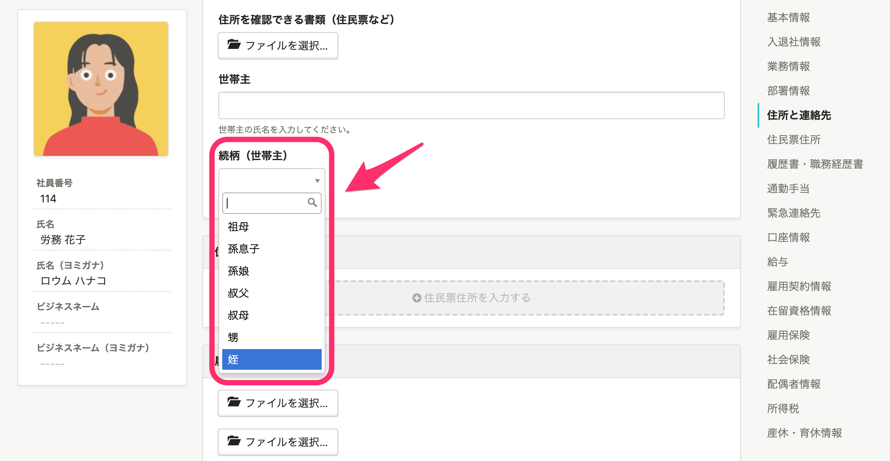

2021年4月9日（金）に行なったアップデートの詳細をお知らせします。

SmartHR基本機能の変更点は、カイゼン1件・不具合修正1件でした。

# 📈 カイゼン

## 登録した続柄マスターを選択できるようにしました

これまでは従業員情報の **［住所と連絡先］［住民票住所］** \> **［続柄（世帯主）］** の項目は、システム標準の続柄のみ選択可能だったため、それ以外の続柄は入力で対応していました。

しかし入力による表記揺れが発生することがあったため、続柄マスターで登録した「続柄」も選択できるようにしました。

なお **［緊急連絡先（続柄）］** は、テキスト入力のままです。

# 👨‍⚕️ 不具合修正

従業員招待フォームの項目の並び替えに関する1件の不具合修正を行ないました。
