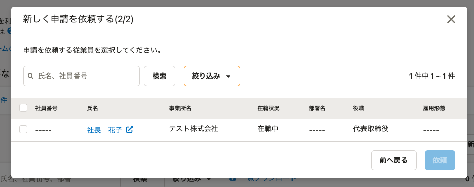

2021年4月12日（月）に行なったアップデートの詳細をお知らせします。

SmartHR基本機能の変更点は、カイゼン2件でした。

# 📈 カイゼン

## SmartHR全体のデザインに合わせて各表の高さを調整しました

下記対象ページの表の高さを、SmartHR全体のデザインに合わせて狭くました。

- 申請
- 申請 > ［新しい申請］ダイアログ
- 育児休業給付金申請
- 共通設定
    - 権限
    - 給与支給形態
    - 雇用形態
    - 続柄
    - 役職
    - カスタム従業員項目
    - カスタム従業員項目詳細
    - 申請 > 経路 > ［承認者の追加］ダイアログ
    - アクセストークン

例：申請 > ［新しい申請］ダイアログ

| 変更前 | 変更後 |
| --- | --- |
|      |  |

## 退職手続きで「退職日」を過去の日付に設定した場合、ステータスを **［退職済］** にするようにしました

これまでは退職手続きを作成する際に「過去日」で退職日を設定すると、在籍状況のステータスは **［退職済］** に変更されない仕様でした。

今回の変更で、「退職日」を過去の日付で作成した場合は在籍状況を **［退職済］** にするようにしました。
