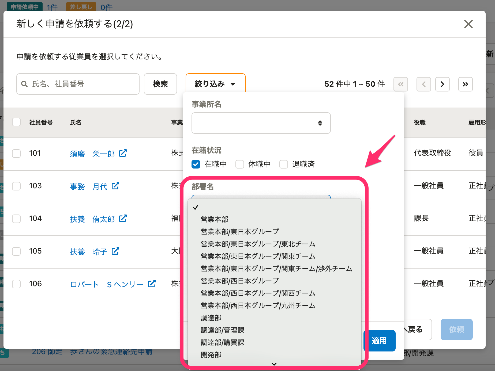
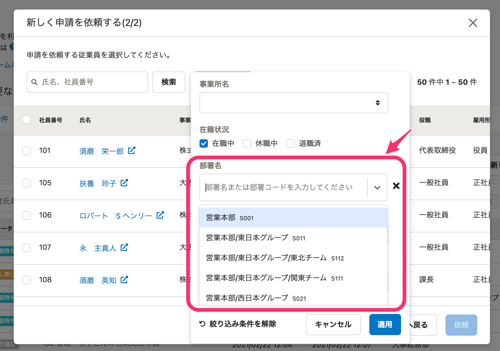

2021年4月13日（火）に行なったアップデートの詳細をお知らせします。

SmartHR基本機能の変更点は、カイゼン3件・不具合修正1件でした。

# 📈 カイゼン

## 従業員情報の一括登録・更新の内部動作をカイゼンしました

これまでの従業員情報の一括登録・更新処理の内部的な動作を見直し、完了までにかかる時間を短縮しました。

## 文書配付機能との連携部分でエラーが発生した際、意図しないエラーがでないようにしました

文書配付機能との連携部分でエラーが発生した場合、意図しないエラーがでないようにしました。

## 申請依頼ダイアログで、部署名・部署コードで絞り込めるようにしました

これまでは、申請依頼のダイアログで依頼する従業員を部署で絞り込む場合は、リストから部署を選択する仕様になっていました。

しかしこの仕様だと、部署が多い場合にリストを下までスクロールする手間があったため、今回の改修で、部署名や部署コードで絞り込めるようにしました。

| 変更前 |  |
| --- | --- |
| 変更後 |  |

# 👨‍⚕️ 不具合修正

申請の依頼や提出をした際のエラー挙動に関する1件の不具合修正を行ないました。
