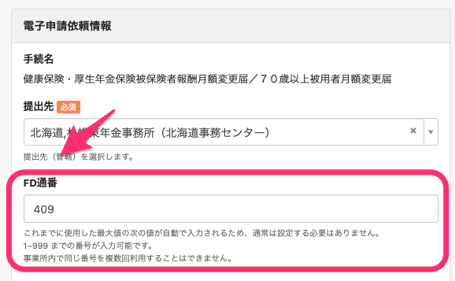
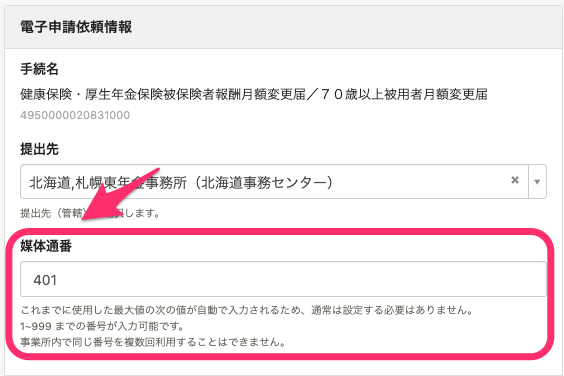

2021年4月15日（木）に行なったアップデートの詳細をお知らせします。

SmartHR基本機能の変更点は、カイゼン1件でした。

# 📈 カイゼン

## 報酬月額の電子申請依頼情報にある［FD通番］を［媒体通番］に名称変更しました

報酬月額の変更手続きで電子申請を依頼する際に使われる **［FD通番］** という項目の名称を、現在の日本年金機構の表記に合わせて **［媒体通番］** に変更しました。

| 変更前 | 変更後 |
| --- | --- |
|  |  |
